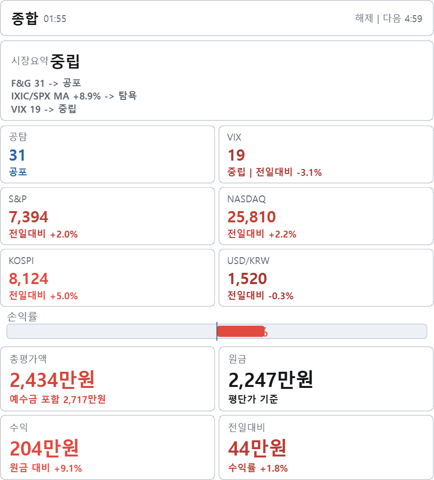

# Market Overlay

시장 상태와 개인 포트폴리오 흐름을 데스크톱 오버레이로 확인하는 Windows용 투자 보조 도구입니다.

## 다운로드

최신 설치파일은 GitHub Releases에서 받습니다.

- 최신 릴리즈: [v2.1.0](https://github.com/Link-1214/market-overlay/releases/tag/v2.1.0)
- 설치파일: `MarketOverlaySetup_v2.1.exe`
- SHA-256:

```text
514355869C9A12A8DCC2AE8BA4CEE14C1C07E121481E6143C5917D7AB91EBF37
```

## 빠른 사용 안내

- [텍스트 사용자 가이드](USER_GUIDE_V2_1.txt)
- [이미지로 보는 사용자 가이드](docs/USER_GUIDE_SCREENSHOT_V2_0.md)
- [v2.1 패치노트](PATCH_NOTES_V2_1.txt)
- [릴리즈 노트](RELEASE_NOTES_V2_1.md)



## 주요 기능

- 시장 오버레이: CNN Fear & Greed, VIX, USD/KRW, NASDAQ Composite, S&P 500, KOSPI
- 종합 오버레이: 시장 상태와 포트폴리오 핵심 수치를 한 화면에 압축 표시
- 내 포트폴리오 오버레이: 총평가액, 원금, 수익, 전일대비, 포트/현금 비중 요약
- 포트폴리오 장부: 보유종목, 예수금, 매매기록, 배당기록 관리
- 성과비교/트리맵: 현재 보유 구성 기준 기간별 흐름 확인
- 일본 종목/JPY: `.T` 종목과 JPY 평단가·예수금 원화 환산
- 업데이트 확인: GitHub 정식 Release 알림과 버전별 숨김
- 백업/복원: 사용자 데이터 내보내기와 가져오기

## 사용자 데이터

개인 데이터는 설치 폴더가 아니라 아래 경로에 저장됩니다.

```text
%APPDATA%\MarketOverlay
```

포함되는 항목:

- 포트폴리오와 보유종목
- 예수금
- 매매기록과 배당기록
- 사용자 표시명 보정
- 앱 설정

업데이트 설치는 개인 데이터를 보존합니다. 제거 시 개인 데이터 삭제 여부를 선택할 수 있습니다.

## 문서

- [사용자 가이드](USER_GUIDE_V2_1.txt)
- [이미지로 보는 사용자 가이드](docs/USER_GUIDE_SCREENSHOT_V2_0.md)
- [v2.1 패치노트](PATCH_NOTES_V2_1.txt)
- [릴리즈 노트](RELEASE_NOTES_V2_1.md)

스크린샷 기반 안내 이미지는 `docs/images/user_guide_v2_0/`에 정리되어 있습니다.

## 주의

- 이 앱은 투자 판단을 대신하지 않는 보조 도구입니다.
- Yahoo Finance/CNN JSON 기반 조회값은 증권사 HTS/MTS와 지연, 환율, 세금, 수수료 기준이 다를 수 있습니다.
- 코드 서명이 없는 개인 제작 빌드라 Windows SmartScreen 또는 보안 프로그램 경고가 표시될 수 있습니다.
- GitHub가 자동 표시하는 `Source code(zip/tar.gz)`는 public 배포 저장소의 압축본이며, 앱 실제 소스코드는 포함하지 않습니다.
