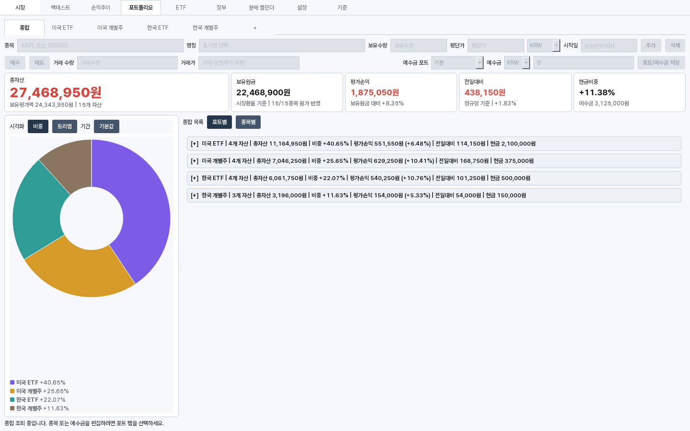

# Market Overlay

Windows 바탕화면에서 시장 흐름과 내 포트폴리오를 함께 확인하는 개인용 투자 보조 도구입니다. 증권사 로그인이나 자동 매매 없이 보유내역을 직접 관리합니다.

## v2.5.0

이 문서는 v2.5.0 사용 기준입니다. [v2.5.0 릴리즈와 다운로드](https://github.com/Link-1214/market-overlay/releases/tag/v2.5.0)에서 설치파일과 SHA-256을 확인하세요.

- [텍스트 사용자 가이드](USER_GUIDE_V2_5.txt)
- [이미지로 보는 사용자 가이드](docs/USER_GUIDE_SCREENSHOT_V2_5.md)
- [패치노트](PATCH_NOTES_V2_5.txt)
- [릴리즈 노트](RELEASE_NOTES_V2_5.md)
- [변경이력](CHANGELOG.md)

이미지는 가상 계좌와 시세를 사용한 실제 화면입니다.

## 주요 화면

| 화면 | 확인할 내용 |
|---|---|
| 시장 | 지수·공포탐욕·VIX·환율·미국 선물 |
| 백테스트 | 지금 보유 종목·수량을 과거에도 보유했다고 가정한 비교 |
| 손익추이 | 기록으로 재현한 보유원금·평가액과 누적 총손익 변화 |
| 포트폴리오 | 현재 보유분·평가손익·예수금·현금비중 |
| ETF | 한국·미국 ETF 구조, 비용, 편입종목, 업종, 분배 정보 |
| 장부 | 매매·입출금·배당 기록 |
| 분배 캘린더 | 연도별 받은 분배와 향후 예상 |
| 설정·기준 | 표시·갱신·백업과 계산·해석 기준 |

## 헷갈리지 않는 계산 기준

총자산은 보유평가액 + 예수금입니다. 평가손익은 보유평가액 - 현재 보유분의 취득원가이며 과거 실현손익·배당·입출금을 더하지 않습니다. 누적 총손익은 손익추이에서 별도로 확인합니다.

외화 취득원가는 매수일 시장환율, 현재 평가와 외화 예수금은 현재 환율을 씁니다. 전일대비는 정규장 기준입니다. 세금·수수료 차감 전이므로 증권사 실수령 수익과 다를 수 있습니다.

배당 기록과 분배 캘린더는 배당락일·세전 기준입니다. 실제 현금 입금월이나 세후 지급액과 다를 수 있습니다. 원가 미확인 종목은 손익에서 제외하고 반영 범위를 표시합니다.

## ETF 데이터

한국 1,163종과 미국 5,241종, 총 6,404종을 동봉합니다. 목록은 최대 250종을 표시하지만 검색은 전체를 대상으로 합니다. 전체 목록은 시장별 AUM 순이며 내 ETF는 보유평가액 비중 순입니다.

공시 기준일은 운용사마다 다르고, 미국 데이터는 실제 편입 기준일 미제공으로 수집일을 표시합니다. BNK 7종(2026-08-10)과 TIME 18종(2026-08-20)은 마지막 검증 원문을 보존합니다. 일부 상품은 구성·업종·비용 정보를 제공하지 않습니다. 예상 분배는 과거 이력 기반 참고값입니다.

## 설치와 데이터

Windows용 설치파일을 실행하세요. 기존 v2.4가 있다면 같은 설치 경로로 업데이트할 수 있습니다. 먼저 설정의 데이터/백업에서 백업을 내보내는 것을 권장합니다.

개인 기록은 `%APPDATA%\MarketOverlay`에 저장됩니다. 제거 시 개인 데이터 삭제를 선택하지 않으면 기록을 보존합니다. 코드 서명이 없는 개인 빌드이므로 보안 경고가 나타날 수 있습니다. 다운로드 출처와 배포된 SHA-256을 확인하고 보안 기능을 임의로 해제하지 마세요.

이 저장소는 설치본·사용자 문서 배포용입니다. 문제 제보는 [Issues](https://github.com/Link-1214/market-overlay/issues)를 이용하되 계좌번호·개인 잔고·백업 파일은 공개하지 마세요. 투자 판단과 주문을 대신하는 앱이 아닙니다.
