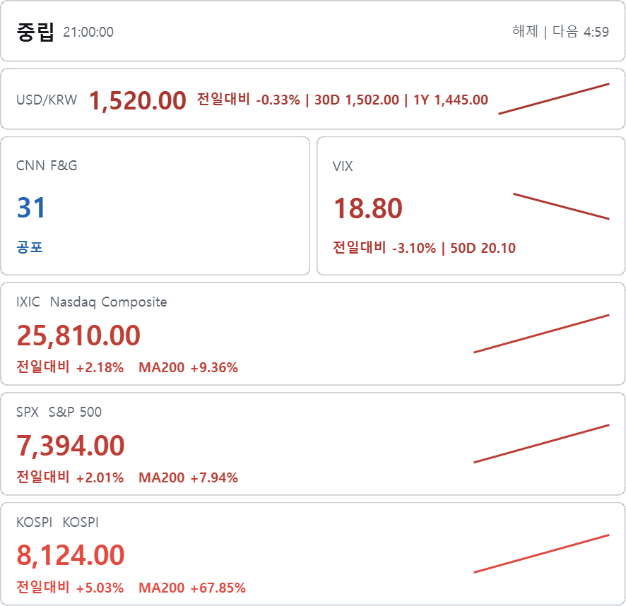
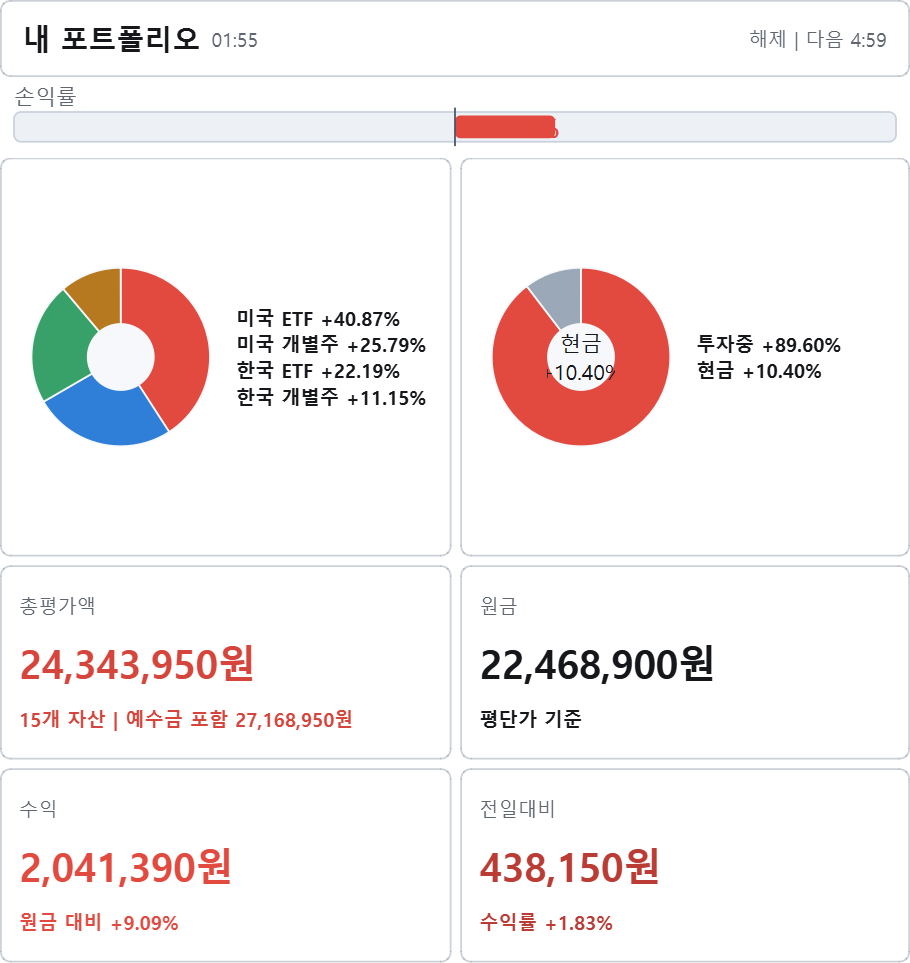
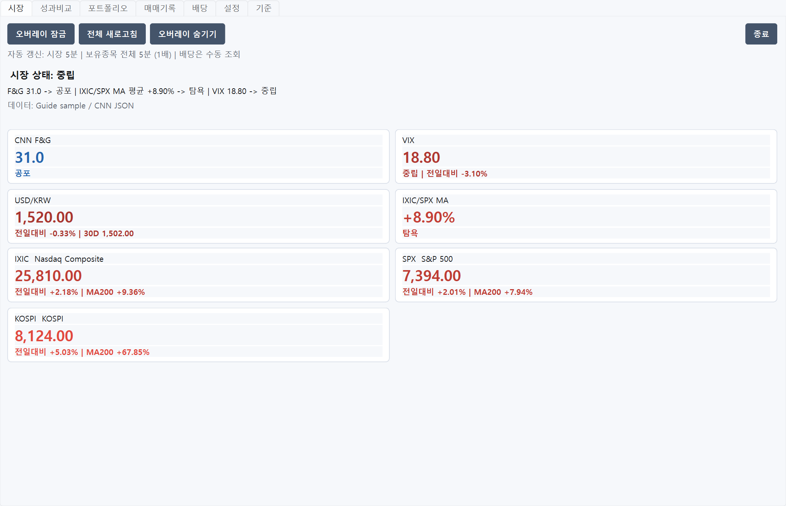
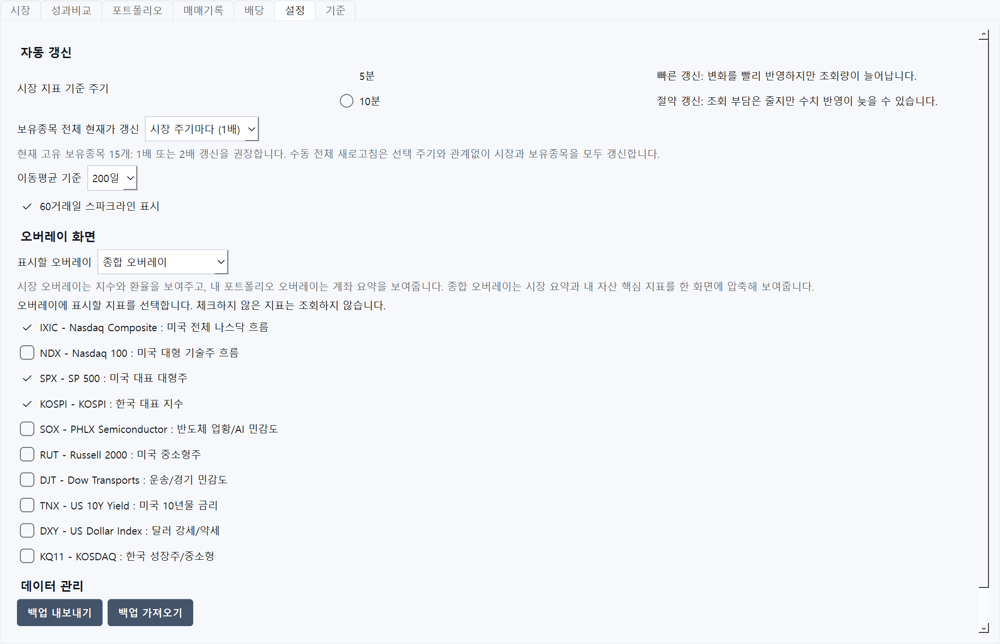
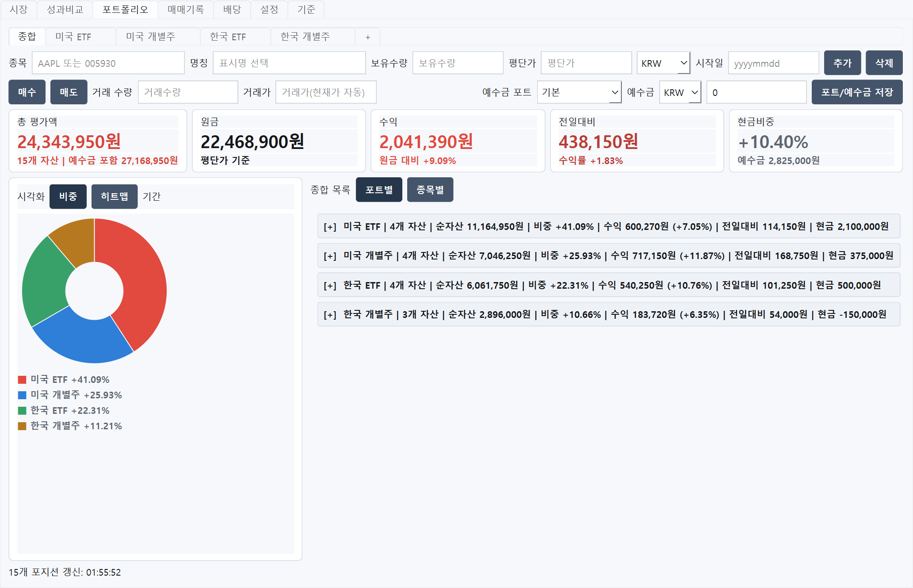
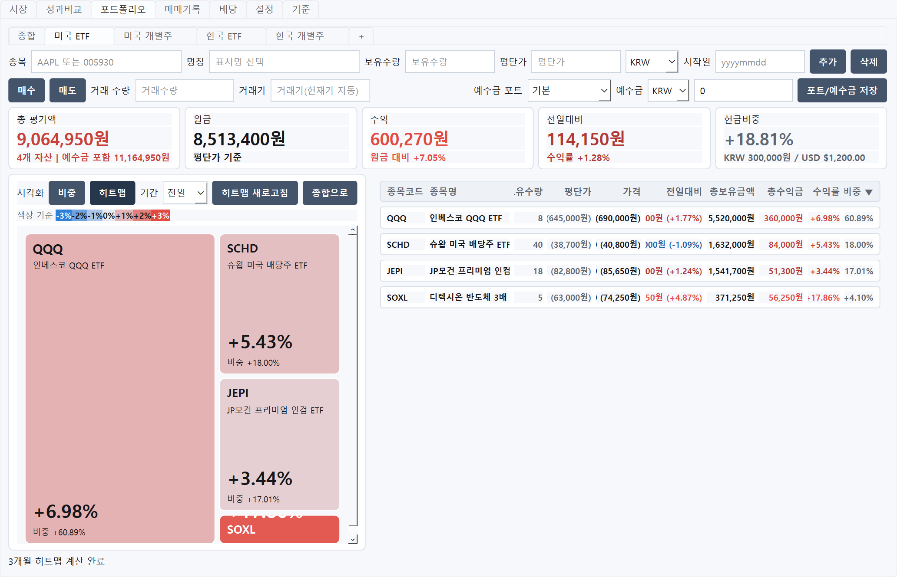
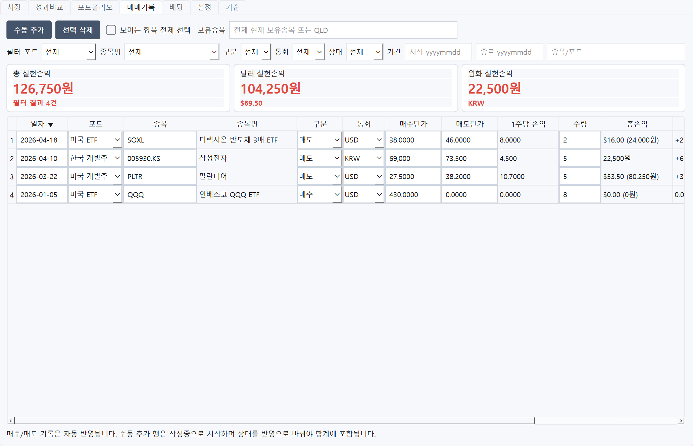
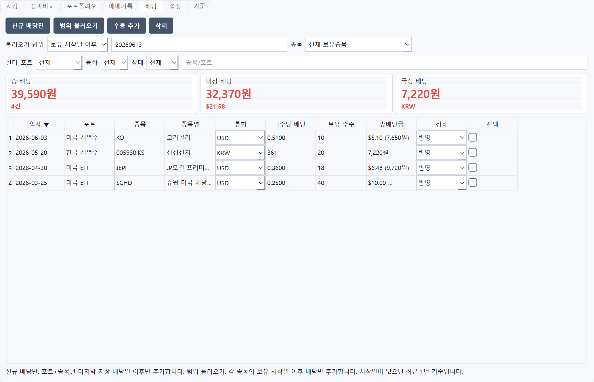
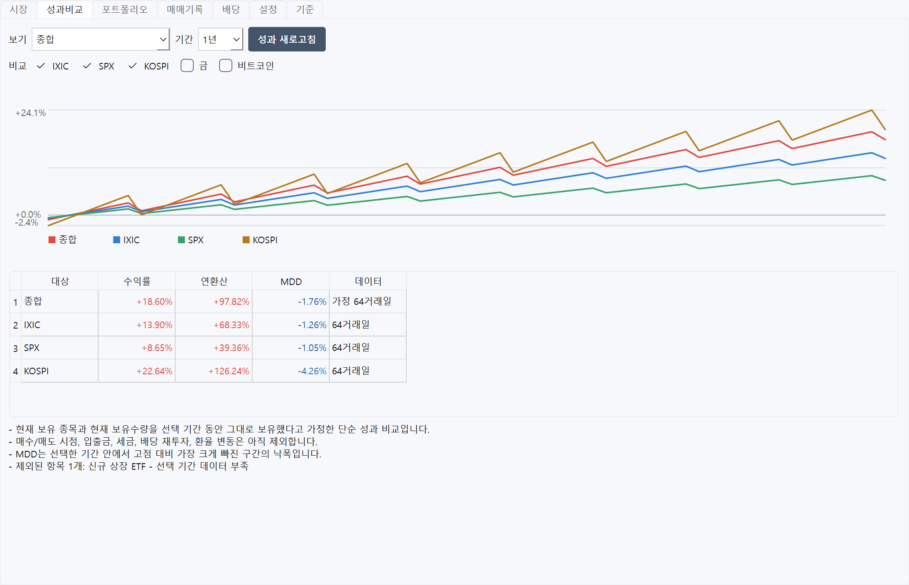

# Market Overlay 화면 사용 가이드 v2.2

이 문서는 GitHub 공개 가이드에 넣기 위한 스크린샷 중심 사용 설명이다. 아래 화면은 예시 데이터이며, 투자 판단을 대신하지 않는다.

스크린샷은 v2.0 계열 화면 구조를 사용한다. v2.2에서는 시장 데이터 보정, 진단 로그, state schema, 포트폴리오 시각화 영역 조절을 추가했고 기존 `히트맵` 용어는 `트리맵`으로 정리했다.

## 1. 오버레이 화면

Market Overlay는 설정에서 `시장`, `종합`, `내자산` 중 하나를 골라 항상 위 오버레이로 띄울 수 있다.

### 시장 오버레이

- CNN F&G, VIX, USD/KRW, 주요 지수 흐름을 한 화면에 표시한다.
- 초단타용 실시간 체결 도구가 아니라 5분/10분 단위로 시장 상태를 확인하는 보조 화면이다.
- 잠금 상태에서는 뒤 창 클릭을 방해하지 않도록 클릭 통과가 적용된다.
- Yahoo 일봉에서 전일 종가가 잠시 비면 5일 60분봉으로 보정해 전일대비가 비정상적으로 튀는 상황을 줄인다.

### 종합 오버레이

- 시장요약, F&G/VIX/주요 지수/환율, 내 포트폴리오 요약을 함께 보여준다.
- 포트폴리오 금액은 만원 단위로 압축 표시한다.
- 시장 오버레이와 내자산 오버레이를 동시에 크게 띄우기 부담스러울 때 쓰는 압축 모드다.

### 내 포트폴리오 오버레이

- 총평가액, 원금, 수익, 전일대비, 현금비중을 빠르게 확인한다.
- 예수금이 음수면 현금비중 카드가 경고색으로 표시된다.

## 2. 시장 탭

- `오버레이 잠금`: 오버레이를 클릭 통과 상태로 전환한다.
- `전체 새로고침`: 시장 지표와 보유종목 현재가를 함께 갱신한다.
- `오버레이 숨기기`: 오버레이만 숨기고 컨트롤 창은 유지한다.
- 시장 상태는 CNN F&G, IXIC/SPX 이동평균 괴리율, VIX를 가중해 계산한다.
- 데이터 출처가 표시되며, CNN F&G 조회 실패 시 로컬 계산 F&G로 대체될 수 있다.

## 3. 설정 탭

- 시장 갱신 주기와 보유종목 갱신 배수를 설정한다.
- 오버레이 화면 모드를 `시장`, `종합`, `내자산` 중 선택한다.
- 오버레이에 표시할 지수를 선택할 수 있다.
- 백업 내보내기/가져오기로 개인 장부와 설정을 이동할 수 있다.
- 가져오기는 실패 시 기존 데이터를 유지하도록 설계되어 있지만, 중요한 데이터는 먼저 내보내기를 권장한다.
- 현재 버전, 자동 업데이트 확인 여부, 수동 확인, 숨긴 버전 다시 알림을 설정 탭에서 관리한다.
- v2.2부터 `로그 폴더 열기`로 `%APPDATA%\MarketOverlay\logs`의 진단 로그를 확인할 수 있다.
- 진단 로그는 네트워크, 파싱, state, worker 오류 분석용이며 보유수량, 평단가, 예수금 같은 장부 세부값은 남기지 않는다.

## 4. 포트폴리오 탭

- 상단 포트 탭에서 포트폴리오를 선택한다.
- `+` 탭으로 포트를 추가하고, 포트 이름 더블클릭으로 이름을 바꿀 수 있다.
- 종목 입력칸은 티커나 종목코드 일부를 입력하면 자동완성 후보를 보여준다.
- 일본 4자리 코드 또는 `.T` 심볼도 입력할 수 있으며, 일본 종목은 JPY 평단가와 예수금을 지원한다.
- `추가`는 새 보유종목 등록, `삭제`는 선택한 보유종목 삭제다.
- `매수`/`매도`는 거래 수량과 거래가 기준으로 보유수량과 평단가, 예수금을 함께 반영한다.
- 아래 표 행을 더블클릭하면 해당 보유종목이 편집칸에 불러와진다.

### 비중/트리맵 보기

- 카드 아래 영역은 왼쪽 `비중/트리맵` 시각화와 오른쪽 보유 목록으로 나뉜다.
- 가운데 분할선을 드래그하면 시각화와 목록의 폭을 조절할 수 있고, `기본값`으로 25:75 비율에 가깝게 되돌릴 수 있다.
- 트리맵에서 박스 크기는 현재 평가액 비중, 색상은 선택 기간 수익률을 뜻한다.
- 미국 종목은 티커, 국내/일본 종목은 종목명을 박스 안에 우선 표시한다.
- 작은 박스에서 생략된 정보는 마우스를 올려 종목명, 코드, 수익률, 비중, 평가액으로 확인한다.
- 종합 트리맵에서 종목을 누르면 해당 포트폴리오 상세로 이동하고, `종합으로` 버튼으로 돌아올 수 있다.
- 오른쪽 표는 보유수량, 평단가, 현재가, 전일대비, 총보유금액, 총수익금, 수익률, 비중을 보여준다.

## 5. 매매기록 탭

- 포트폴리오 탭에서 매수/매도한 기록이 자동으로 쌓인다.
- `수동 추가`로 과거 거래를 직접 입력할 수 있다.
- 포트, 구분, 통화, 상태, 종목명/메모 키워드로 필터링할 수 있다.
- 표 헤더를 클릭해 날짜, 수익률 등 원하는 기준으로 정렬할 수 있다.
- 보이는 항목 기준으로 선택/삭제할 수 있어 필터링 후 일괄 정리가 가능하다.
- 종목명, 1주당 손익, 총손익, 수익률은 자동 계산값이므로 직접 수정하지 않는다.

## 6. 배당 탭

- 보유종목의 배당 이력을 불러오거나 직접 추가할 수 있다.
- 범위는 전체, 최근 1년, 최근 3년, 보유 시작일 이후, 직접 날짜 지정 중 선택한다.
- 같은 배당일/포트/종목/통화 기준으로 중복을 줄인다.
- 작성중 상태 기록은 합계에서 제외하고, 확인된 기록만 포트폴리오 수익 계산에 반영한다.

## 7. 성과비교 탭

- 현재 보유종목과 현재 보유수량을 선택 기간 동안 그대로 보유했다고 가정한 단순 성과 비교다.
- 매수/매도 시점, 입출금, 세금, 배당 재투자, 환율 변동은 아직 제외한다.
- 기간은 1개월, 3개월, 6개월, 1년, YTD 중 선택한다.
- IXIC, SPX, KOSPI, 금, 비트코인 벤치마크를 체크박스로 켜고 끌 수 있다.
- MDD는 선택한 기간 안에서 고점 대비 가장 크게 빠진 구간의 낙폭이다.
- 반영된 항목 수와 데이터 부족/조회 실패로 제외된 항목 및 주요 사유를 화면에서 확인한다.

## 8. 백업과 개인 데이터

- 개인 데이터는 `%APPDATA%\MarketOverlay`에 저장된다.
- 백업 파일에는 포트폴리오, 보유종목, 매매기록, 배당기록, 사용자 표시명, 업데이트 확인, splitter 위치를 포함한 앱 설정이 들어간다.
- v2.2부터 state에는 `schema_version`이 포함되며, 구버전 `heatmap` 설정은 로드 시 `treemap` 설정으로 자동 이관된다.
- 배포용 문서와 스크린샷에는 실제 사용자 장부를 사용하지 않는다.
- 앱은 보조 도구이며, 데이터 지연과 환율/세금/수수료 기준 차이가 있을 수 있다.
