# Market Overlay 화면 사용 가이드 v2.3

이 문서는 Market Overlay v2.3의 주요 화면을 이미지와 함께 설명하는 사용자 가이드다. 화면의 금액과 종목은 예시 데이터이며 투자 판단을 대신하지 않는다.

## 1. 오버레이 화면

오버레이는 컨트롤 창에서 선택한 정보를 작은 항상 위 화면으로 보여준다. v2.3 기준 오버레이는 `시장`, `종합`, `내 포트폴리오`를 지원하며, 세 화면은 같은 폭 기준으로 맞춰져 전환할 때 화면 폭이 크게 흔들리지 않는다.

### 시장 오버레이

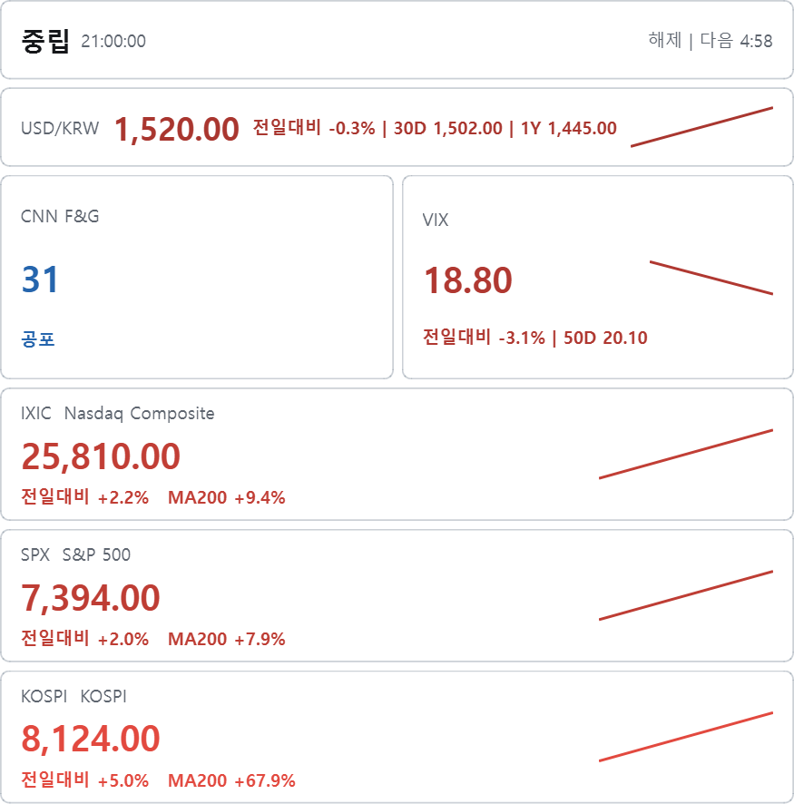

- CNN Fear & Greed, VIX, 주요 지수, USD/KRW를 압축해서 보여준다.
- `시장/갱신` 설정에서 체크한 시장 지표만 조회하고 표시한다.
- 빠른 체결 도구가 아니라 5분 또는 10분 단위로 시장 분위기를 확인하는 보조 화면이다.
- 잠금 상태에서는 뒤쪽 창 조작을 방해하지 않도록 클릭 통과 상태로 사용할 수 있다.

### 종합 오버레이

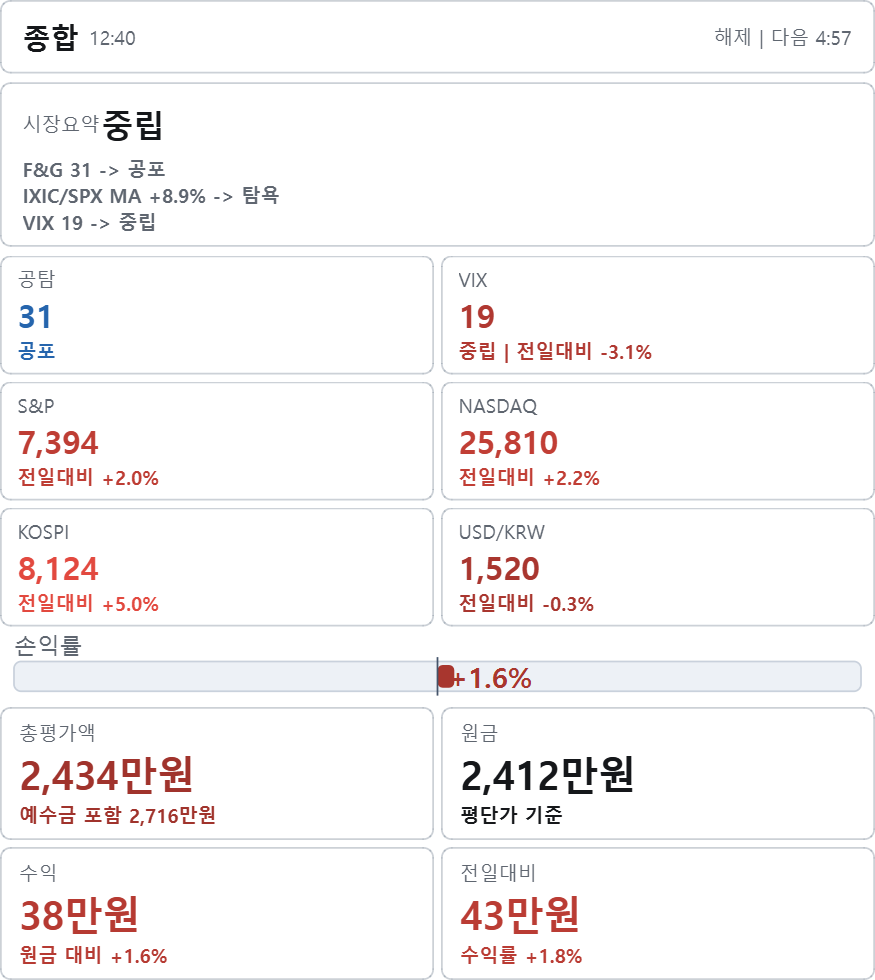

- 상단은 시장요약과 주요 지표, 하단은 내 포트폴리오 핵심 지표를 보여준다.
- v2.3 최종 기준 종합 오버레이는 기본 레이아웃을 유지한다. 별도 `종합 구성` 선택은 제거했다.
- 포트폴리오 영역에는 설정의 `오버레이 표시 방식`이 적용된다.
- 금액은 기본적으로 `만원 단위`로 절삭 표시해 오버레이 폭 안에서 읽기 쉽게 유지한다.

### 내 포트폴리오 오버레이: 도넛

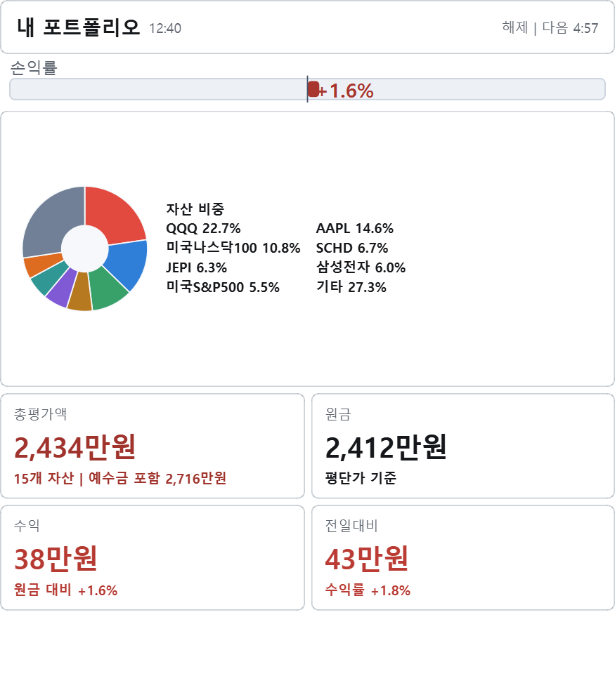

- 총평가액, 원금, 수익, 전일대비를 카드로 보여준다.
- `내 포트폴리오` 보기 방식이 `도넛`이면 자산 비중을 도넛 차트와 범례로 표시한다.
- 비중 기준은 `자산별` 또는 `포트별`이다.
- 포트폴리오를 하나만 쓰는 경우에는 `자산별`이 더 유용하고, 여러 계좌/포트를 구분해서 운용하면 `포트별`도 의미가 있다.
- `기타 묶기`는 비중이 N% 미만이거나 상위 N개를 넘는 항목을 하나의 `기타` 항목으로 합쳐 범례 과밀을 줄인다.

### 내 포트폴리오 오버레이: 트리맵/다크

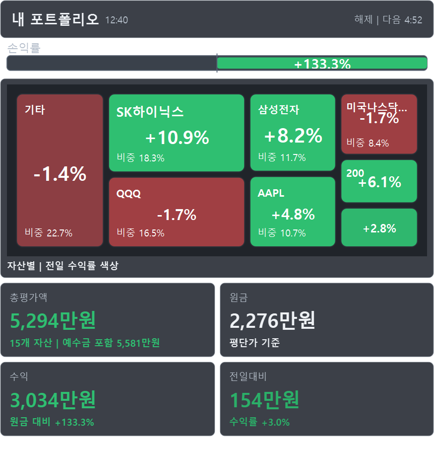

- `내 포트폴리오` 보기 방식이 `트리맵`이면 보유 자산을 박스 크기와 색으로 표시한다.
- 박스 크기는 현재 평가액 비중을 뜻한다.
- 색상은 수익/손실 방향을 뜻한다.
- 다크모드에서는 좋은 값/상승은 녹색, 나쁜 값/하락은 적색 계열로 표시한다.
- 라이트모드에서는 국내 투자자에게 익숙한 기준에 맞춰 상승/좋은 값은 적색, 하락/나쁜 값은 청색 계열로 표시한다.

## 2. 설정 탭

v2.3의 설정 탭은 `일반`, `오버레이`, `시장/갱신`, `데이터/백업`, `업데이트/진단`으로 나뉜다. 화면 관련 설정을 한곳에 몰아두지 않고, 테마는 일반 설정으로, 시장 지표와 갱신 주기는 시장/갱신으로 분리했다.

### 일반: 테마

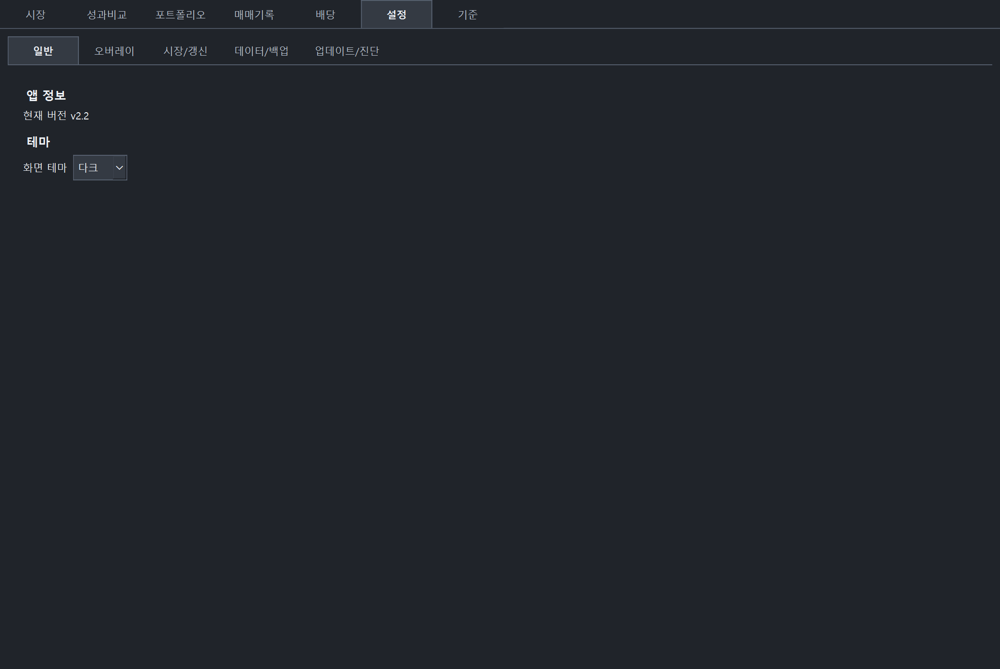

- `화면 테마`에서 `라이트`와 `다크`를 선택한다.
- 기본값은 `라이트`다.
- 테마 선택은 컨트롤 창과 오버레이에 함께 적용된다.
- 다크모드는 회색 계통 배경을 사용하며, 입력칸과 표 영역도 흰색 박스가 튀지 않도록 조정했다.

### 오버레이

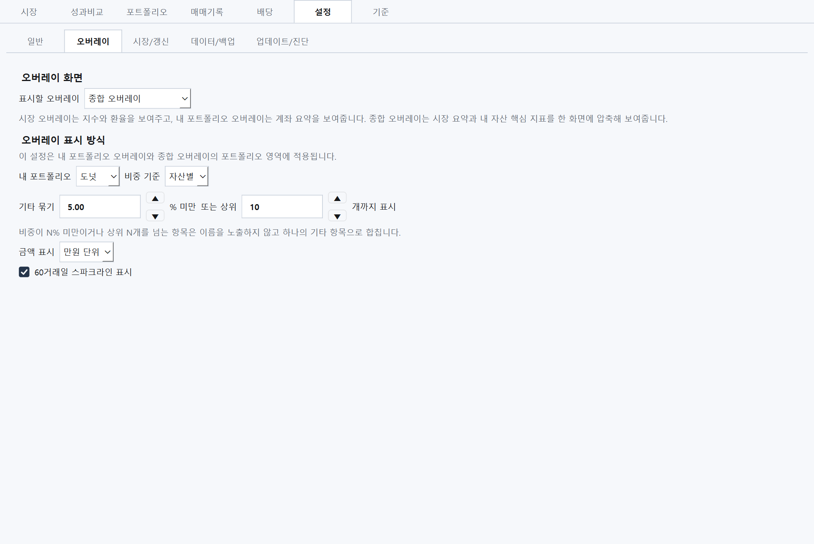

- `표시할 오버레이`: 화면에 띄울 오버레이를 `시장`, `종합`, `내 포트폴리오` 중 선택한다.
- `내 포트폴리오`: 내 포트폴리오 오버레이의 보기 방식을 `도넛` 또는 `트리맵`으로 고른다.
- `비중 기준`: 도넛/트리맵의 묶음 기준을 `자산별` 또는 `포트별`로 선택한다.
- `기타 묶기`: 왼쪽 수치는 N% 미만 기준, 오른쪽 수치는 상위 N개까지 표시 기준이다.
- `▲`/`▼` 버튼: 기타 묶기 수치를 명시적으로 올리거나 내린다.
- 수치 입력칸과 드롭다운은 마우스휠로 값이 바뀌지 않도록 막았다. 스크롤 중 설정이 우연히 바뀌는 일을 줄이기 위한 동작이다.
- `금액 표시`: 오버레이 금액을 `만원 단위` 또는 `원 단위`로 선택한다.

### 시장/갱신

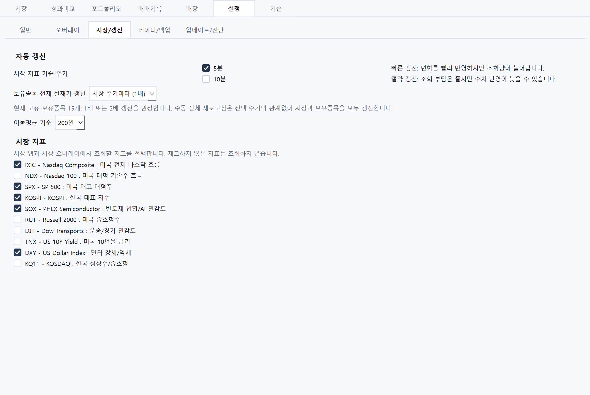

- `시장 지표 기준 주기`: 시장 데이터를 5분 또는 10분마다 갱신한다.
- `보유종목 전체 현재가 갱신`: 보유종목 전체 가격 조회를 시장 주기와 같은 간격으로 할지, 2배/3배/6배로 늦출지, 수동만으로 둘지 정한다.
- `이동평균 기준`: 시장 카드와 판단 문구에 사용할 이동평균 기준일을 선택한다.
- `시장 지표`: 시장 탭과 시장 오버레이에서 조회할 지표를 선택한다. 체크하지 않은 지표는 조회하지 않는다.

## 3. 컨트롤 창 주요 탭

### 시장 탭

- 상단 버튼은 `오버레이 잠금`, `전체 새로고침`, `오버레이 숨기기`, `종료`다.
- `오버레이 잠금`은 오버레이 클릭 통과/이동 상태를 전환한다.
- `전체 새로고침`은 시장 지표와 포트폴리오를 즉시 갱신한다.
- `오버레이 숨기기`는 오버레이 창만 감춘다. 컨트롤 창은 유지된다.
- `종료`는 앱을 종료한다.
- 시장 카드의 색상은 현재 테마의 상승/하락 정책을 따른다.

### 포트폴리오 탭: 목록

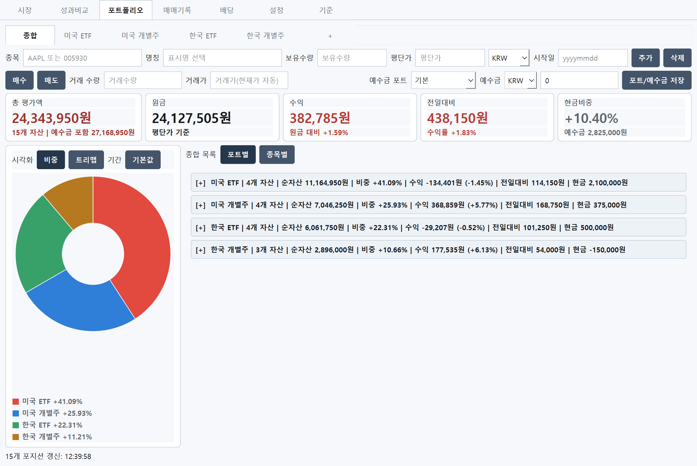

- 상단 입력 영역에서 종목, 명칭, 보유수량, 평단가, 시작일, 예수금을 입력한다.
- `추가`는 보유종목을 새로 추가한다.
- `삭제`는 선택한 보유종목을 삭제한다.
- `매수`/`매도`는 거래 수량과 거래가를 기준으로 보유수량, 평단가, 예수금을 함께 반영한다.
- `포트/예수금 저장`은 현재 포트의 예수금 입력값을 저장한다.
- `종합 목록`, `포트별`, `종목별`은 보유 목록의 묶음 방식을 바꾼다.
- 한국 ETF는 긴 운용사/상품명을 그대로 모두 표시하지 않고, 화면 안에서 읽기 좋은 축약 표시를 사용한다.

### 포트폴리오 탭: 트리맵

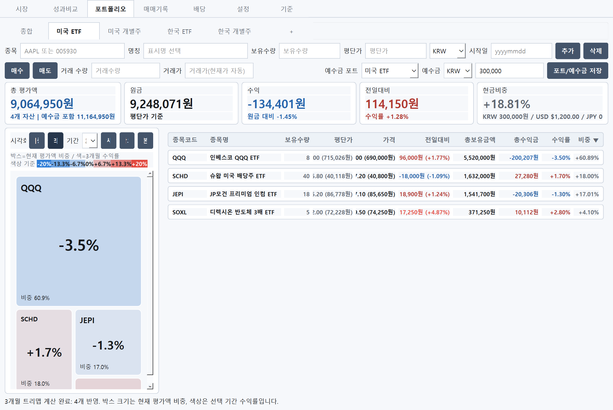

- `시각화 > 트리맵`으로 보유자산을 박스 형태로 볼 수 있다.
- 박스 크기는 현재 평가액 비중이다.
- 색상은 선택 기간 수익률이다.
- `기간`은 트리맵 색상 계산 기준 기간을 선택한다.
- `트리맵 새로고침`은 선택 기간의 가격 데이터를 다시 조회한다.
- `기본값`은 시각화 영역과 목록 영역의 폭을 기본 비율로 되돌린다.

### 매매기록/배당

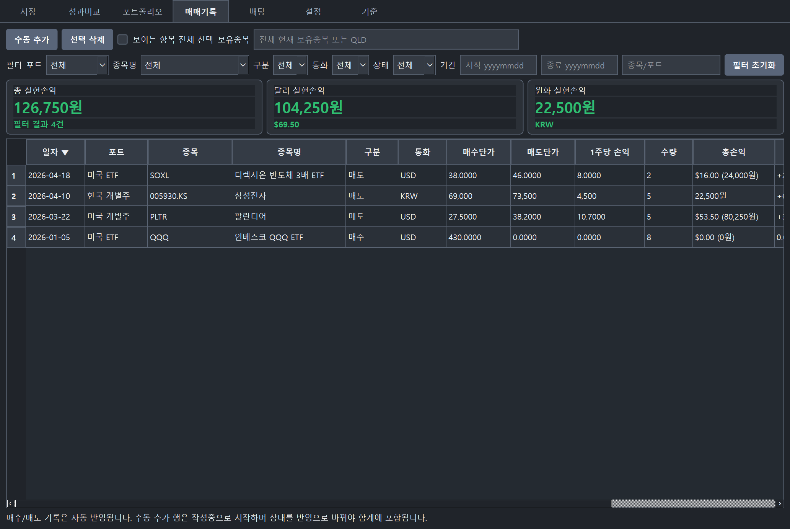

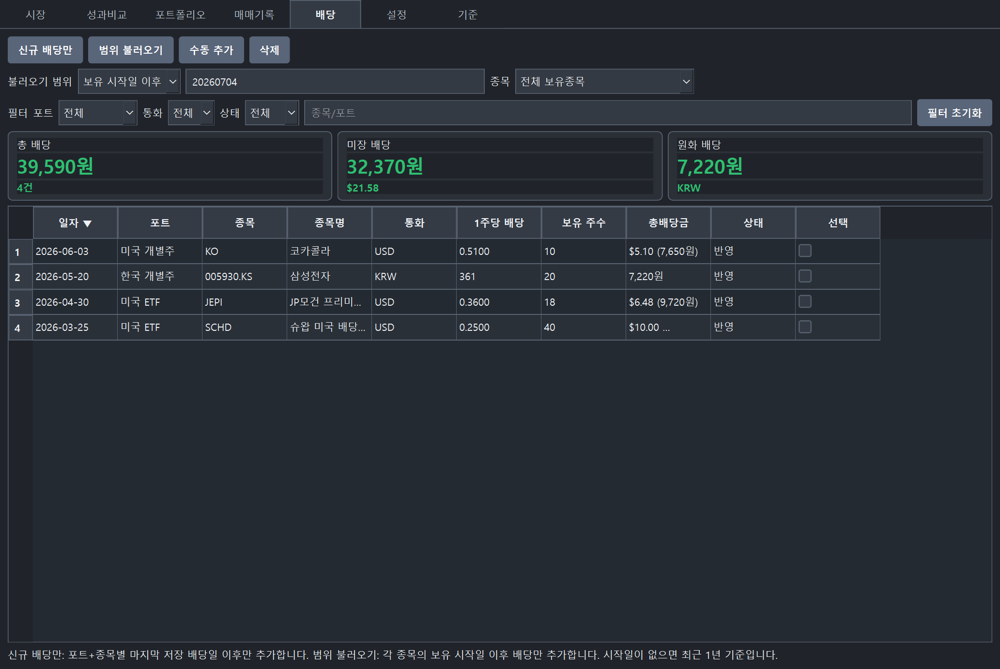

- 매매기록은 포트폴리오 탭에서 처리한 매수/매도 기록을 자동으로 쌓고, 수동 추가도 지원한다.
- 배당 탭은 보유종목 배당 이력을 불러오거나 직접 추가할 수 있다.
- 필터는 포트, 종목명, 구분, 통화, 상태, 기간으로 좁힐 수 있다.
- 다크모드에서도 입력칸, 드롭다운, 표 셀의 배경과 글자색이 구분되도록 조정했다.

## 4. 색상과 테마 기준

- 라이트모드: 상승/수익/좋은 값은 적색, 하락/손실/나쁜 값은 청색으로 표시한다.
- 다크모드: 상승/수익/좋은 값은 녹색, 하락/손실/나쁜 값은 적색으로 표시한다.
- 중립값이나 변화가 거의 없는 값은 muted 색상으로 표시한다.
- 오버레이 다크모드는 회색 계통 카드와 바 배경을 사용한다.
- 도넛과 트리맵은 항목 구분을 위해 여러 색을 쓰지만, 수익률 방향은 테마별 상승/하락 정책을 우선한다.

## 5. 백업과 개인 데이터

- 개인 데이터는 `%APPDATA%\MarketOverlay`에 저장된다.
- 백업에는 포트폴리오, 보유종목, 매매기록, 배당기록, 사용자 표시명, 테마, 오버레이 표시 정책, splitter 위치 등 사용자 설정이 포함된다.
- 가져오기 실패 시 기존 데이터를 유지하도록 설계되어 있지만, 중요한 변경 전에는 먼저 백업 내보내기를 권장한다.
- 공개용 문서와 스크린샷은 예시 데이터로 만든 화면이며 실제 사용자 장부가 아니다.

## 6. v2.3에서 확인할 핵심 변화

- 설정 내부 탭 구조가 `일반`, `오버레이`, `시장/갱신`, `데이터/백업`, `업데이트/진단`으로 정리됐다.
- 오버레이 표시 방식에서 `도넛`과 `트리맵`을 선택할 수 있다.
- `자산별`/`포트별` 비중 기준을 선택할 수 있다.
- 도넛 범례는 기타 묶기 조건으로 과밀을 줄인다.
- 오버레이 금액은 기본적으로 만원 단위로 표시할 수 있다.
- 컨트롤 창과 오버레이가 모두 다크모드를 지원한다.
- 매매기록/배당의 표와 입력 영역도 다크모드 가독성을 맞췄다.
- 한국 ETF 표시는 긴 브랜드/상품명을 줄여 화면 안에서 더 읽기 쉽게 표시한다.
