# Market Overlay 화면 사용 가이드 v2.4

이 문서는 Market Overlay v2.4의 주요 화면을 이미지와 함께 설명하는 사용자 가이드다. 화면의 금액과 종목은 예시 데이터이며 투자 판단을 대신하지 않는다.

v2.4는 미국 선물, 프리ㆍ애프터 시세, 일별 확정 기록을 추가한 릴리즈다. 새 정보가 늘어난 만큼 **어떤 숫자가 확정값이고 어떤 숫자가 참고값인지** 화면에서 구분할 수 있게 하는 데 초점을 맞췄다.

## 1. 시장 탭과 미국 선물

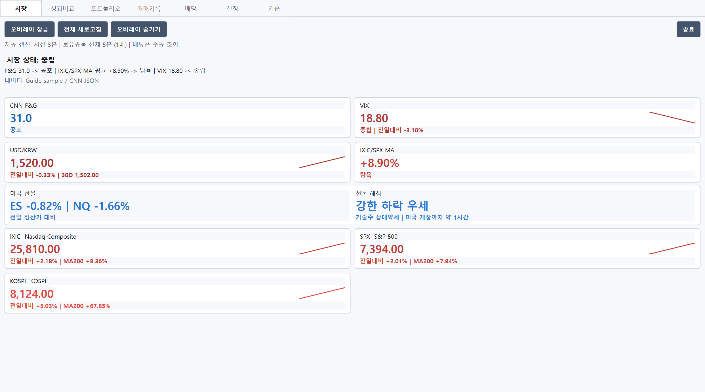

- v2.4는 시장 탭에 **미국 선물 밴드**를 추가했다. 왼쪽은 계약별 등락, 오른쪽은 해석이다.
- 왼쪽 `ES -0.82% | NQ -1.66%`는 **전일 정산가 대비** 등락이다. 현물 지수의 전일대비와는 기준이 다르므로 합산하지 않는다.
- 오른쪽 `선물 해석`은 두 계약의 평균 등락으로 방향을 판정하고, 보조문구에 기술주 상대강도와 **미국 개장까지 남은 시간**을 함께 보여준다.
- 개장까지 남은 시간을 함께 보는 이유는, 선물 방향이 확정이 아니라 조회 시점의 기대이기 때문이다. 개장이 멀수록 바뀔 여지가 크다.
- 정규장이 열려 있으면 `미국 정규장 진행 중`, 1시간 미만이면 `미국 개장 임박`으로 바뀐다.
- 조회 누락, 휴장ㆍ정비, 30분 이상 지연 상태에서는 방향을 해석하지 않고 데이터 상태만 표시한다. 이때는 개장까지 남은 시간도 붙이지 않는다.

## 2. 기준 탭: 선물 해석 기준

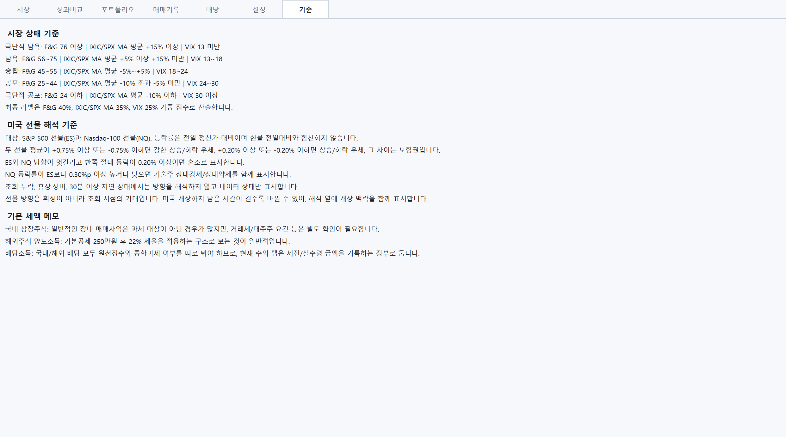

- 화면이 어떤 기준으로 방향을 판정하는지 숫자로 공개한다.
- 두 선물 평균이 `+0.75%` 이상이면 강한 상승 우세, `+0.20%` 이상이면 상승 우세이며, 하락도 대칭이다. 그 사이는 보합권이다.
- ES와 NQ 방향이 엇갈리고 한쪽 절대 등락이 `0.20%` 이상이면 혼조로 표시한다.
- NQ 등락률이 ES보다 `0.30%p` 이상 높거나 낮으면 기술주 상대강세ㆍ상대약세를 함께 표시한다.

## 3. 설정: 일반

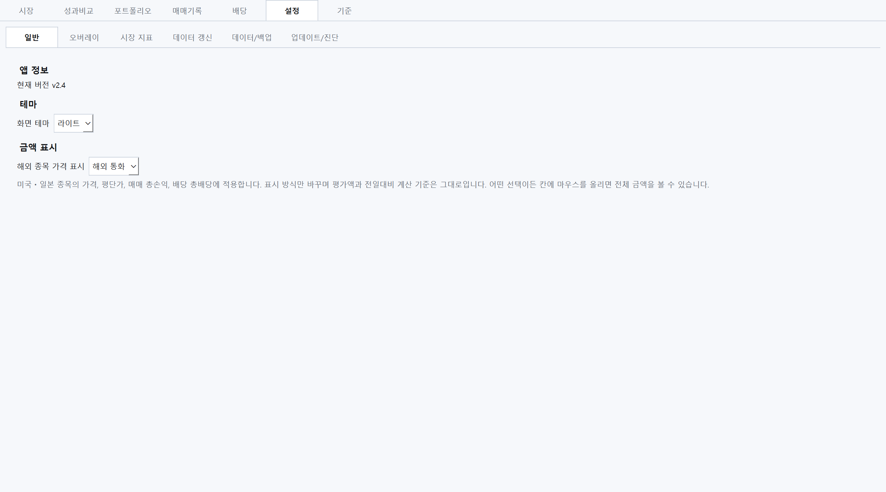

- `화면 테마`는 라이트와 다크를 선택한다.
- v2.4는 `해외 종목 가격 표시`를 추가했다. 미국ㆍ일본 종목의 가격, 평단가, 매매 총손익, 배당 총배당에 함께 적용한다.
  - `해외 통화`(기본): `$465.52`
  - `원화`: `698,280원`
  - `둘 다`: `$465.52 (698,280원)`
- 기본값이 `해외 통화`인 이유는 한 칸에 단가와 원화를 모두 넣으면 표가 좁아 글자가 잘리기 때문이다. 원화 환산액은 `총보유금액`과 `총수익금` 칸에서 확인할 수 있다.
- **표시 방식만 바꾸며 평가액과 전일대비 계산 기준은 바뀌지 않는다.** 어떤 선택이든 칸에 마우스를 올리면 전체 금액을 볼 수 있다.

## 4. 설정: 시장 지표와 데이터 갱신

v2.4는 기존 `시장/갱신` 탭을 성격에 따라 둘로 나눴다. **무엇을 조회할지**는 `시장 지표`, **언제 조회할지**는 `데이터 갱신`이다.

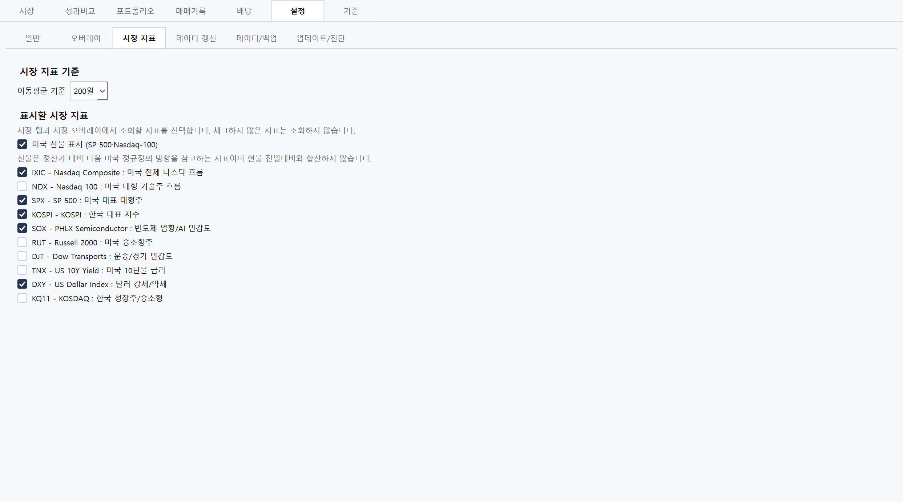

- `미국 선물 표시`를 끄면 선물을 아예 조회하지 않고 밴드도 숨긴다.
- 체크하지 않은 지표는 조회하지 않는다. 필요한 지표만 켜면 조회량이 줄어든다.

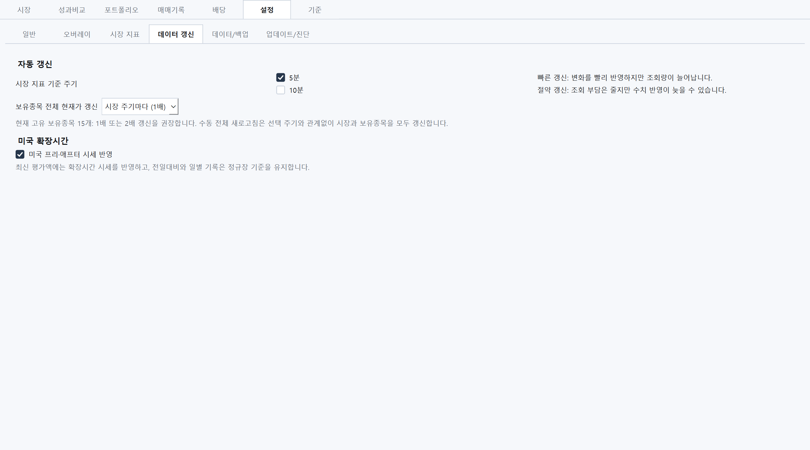

- 시장 지표 기준 주기와 보유종목 현재가 갱신 배수를 설정한다.
- `미국 프리ㆍ애프터 시세 반영`도 여기에 있다. 끄면 확장시간 시세를 조회하지 않고 정규장 기준만 사용한다.

## 5. 포트폴리오: 프리ㆍ애프터 표시

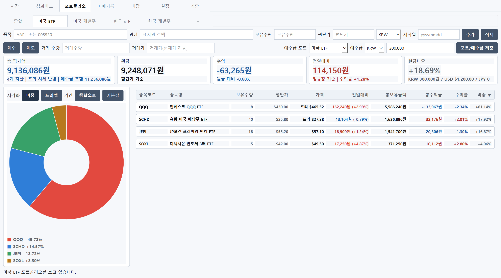

- 종목의 `가격`은 **활성 세션의 최신 단일 가격 하나**만 보여준다. 프리ㆍ애프터 시세를 쓰는 중이면 `프리 $465.52`처럼 배지를 붙여 기준을 알린다.
- 배지가 없는 종목(`$57.10`)은 정규장 가격이다. 같은 표 안에서도 종목마다 세션이 다를 수 있다.
- 프리ㆍ애프터 세션이 끝났거나 장외 시세가 30분 이상 지연되면 마지막 장외가를 붙들지 않고 **정규장 종가로 되돌아간다**.
- 종목 행의 `전일대비`는 활성 세션 현재가와 **전일 정규장 종가**를 비교한 값이다.
- 상단 카드의 `전일대비`는 `정규장 기준`으로 표시한다. 포트폴리오 전체 전일대비, 트리맵 `전일` 색상, 일별 기록은 **정규장 가격만** 사용한다. 확장시간 가격은 현재가ㆍ평가액ㆍ평가손익ㆍ비중에만 반영한다.
- `총 평가액` 카드는 `프리 시세 반영` 여부를 알려 주고, 반영 종목 수(`4/8종목 반영`)와 참고 평가액 안내는 화면 하단 상태 문구에서 확인한다.

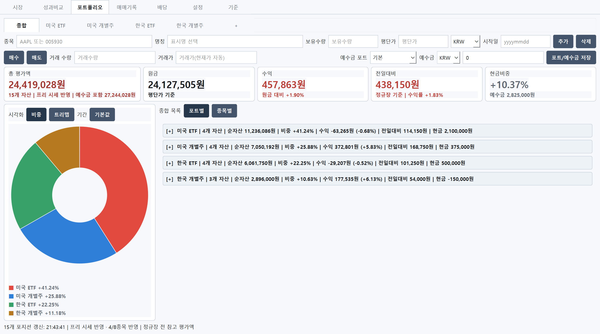

- `종합`에서는 포트별ㆍ종목별 롤업으로 전체를 확인한다.

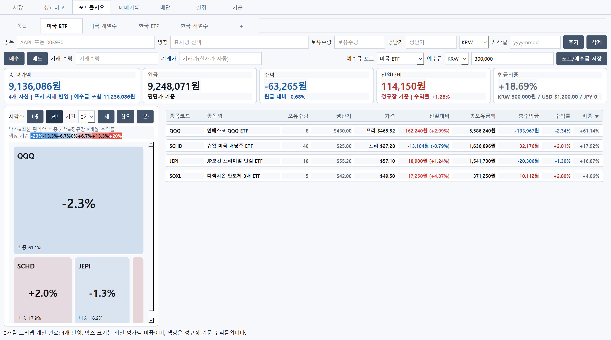

- 트리맵은 박스 크기로 현재 평가액 비중을, 색상으로 선택 기간 수익률을 보여준다.
- 크기는 최신 평가액을 쓰지만 `전일` 색상은 정규장 기준이다.

## 6. 오버레이

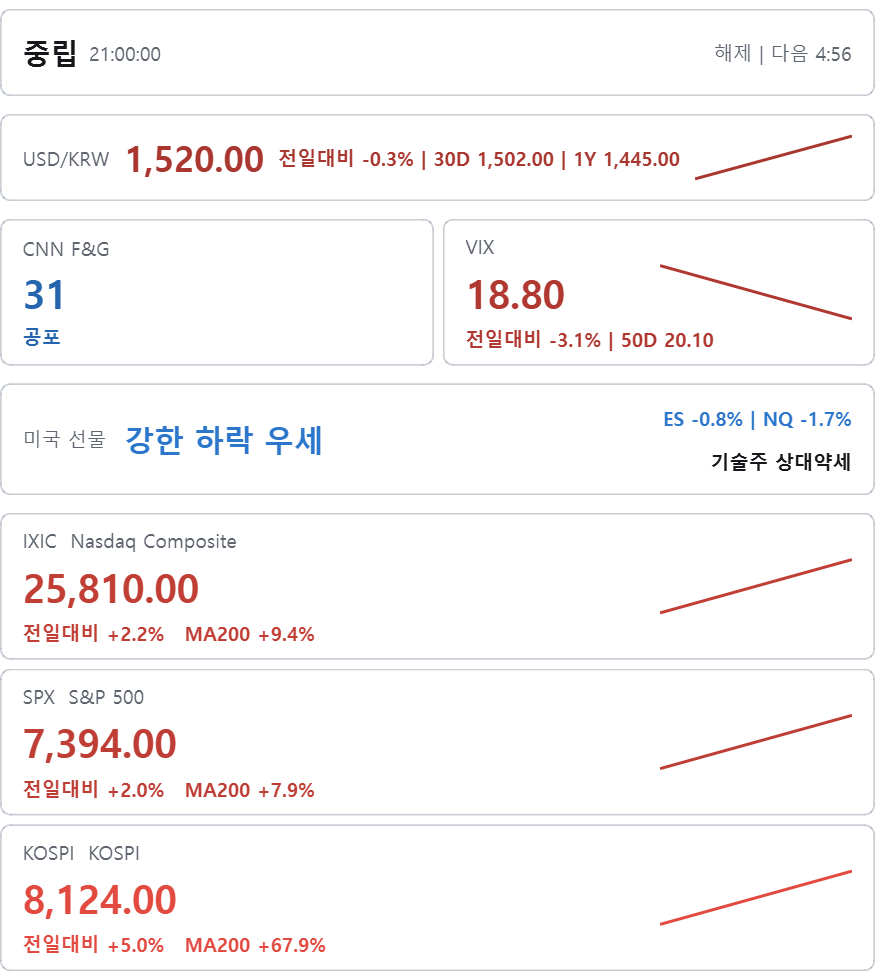

- 시장 오버레이는 공탐ㆍVIX 아래에 미국 선물 밴드를 둔다. 선물을 끄면 밴드가 사라지고 오버레이 높이도 함께 줄어든다.

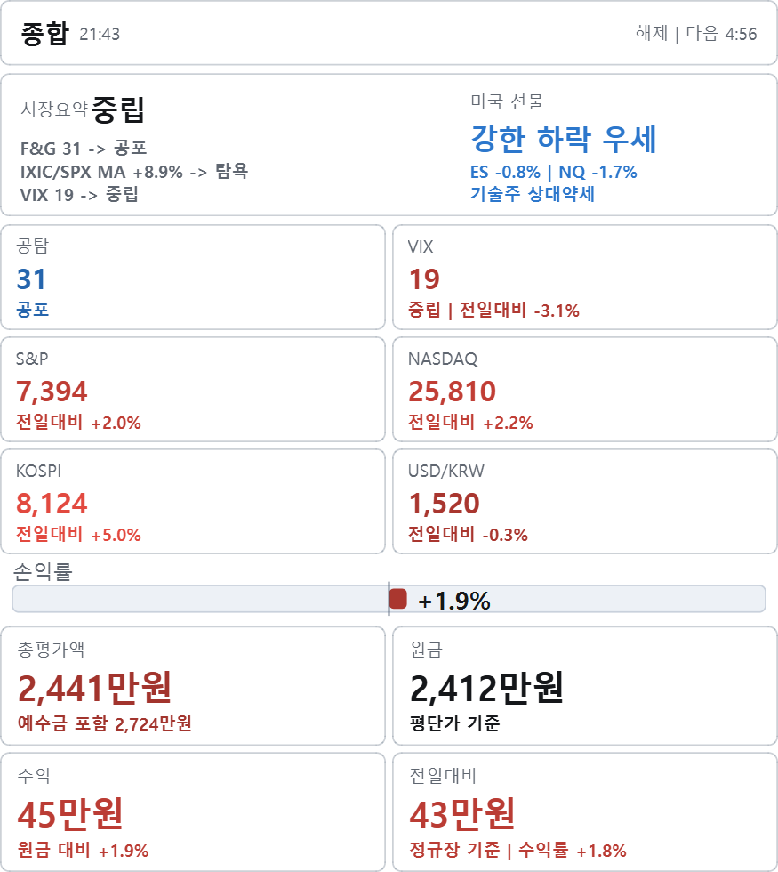

- 종합 오버레이는 시장요약과 포트폴리오 핵심 지표를 함께 보여준다.

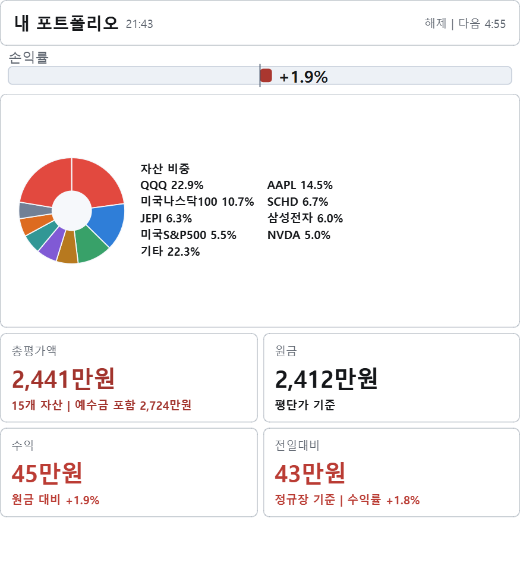

- 내 포트폴리오 오버레이에는 선물을 넣지 않는다. 자산 비중과 요약 카드에 집중한다.

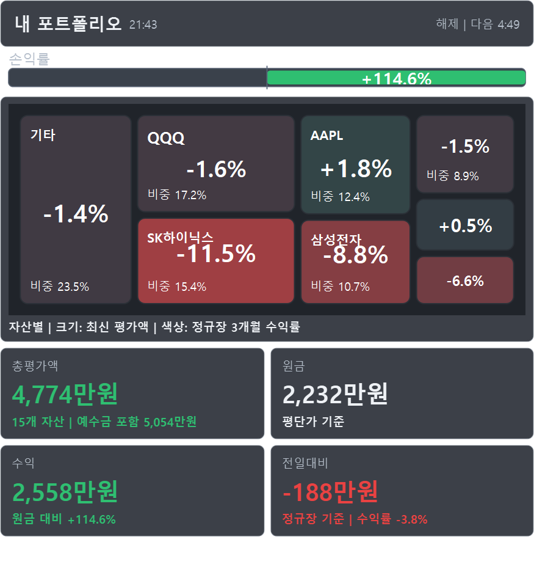

- 보기 방식은 `도넛`과 `트리맵` 중 선택한다.

## 7. 다크 테마

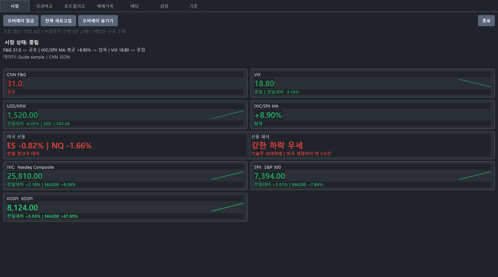

- 라이트는 상승/좋음=적색, 하락/나쁨=청색 기준이다.
- 다크는 상승/좋음=녹색, 하락/나쁨=적색 기준이다.

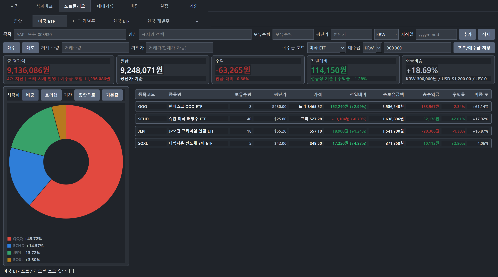

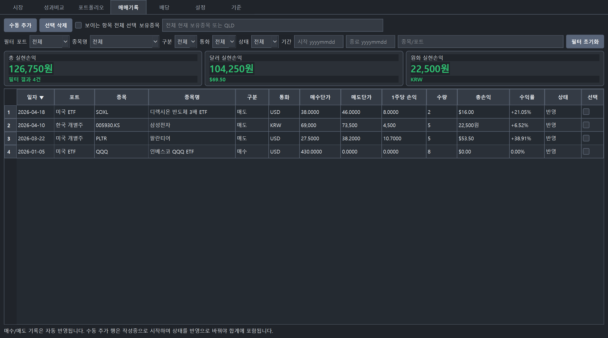

- 매매기록과 배당의 `총손익`ㆍ`총배당`에도 `해외 종목 가격 표시` 설정이 함께 적용된다.

## 8. 데이터와 백업

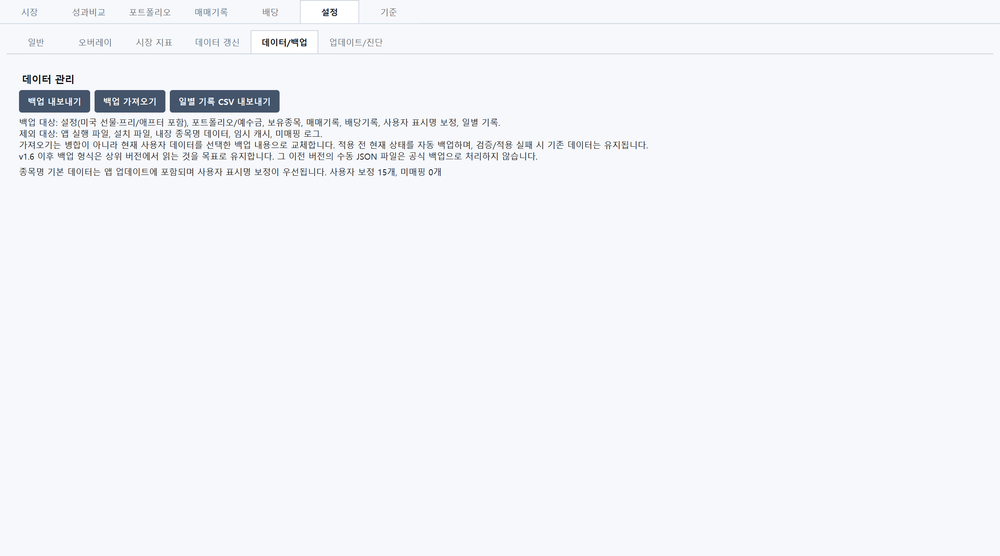

- 시장 지수와 선물의 확정 종가ㆍ정산가는 일봉에서 누락 거래일을 보충한다. 포트폴리오 일별 요약은 앱이 실행되어 모든 보유종목의 정규장 가격이 확정된 날에 저장하며, 앱을 실행하지 않았던 과거 평가액은 임의로 만들지 않는다. 확장시간 가격은 확정 일별 기록에 넣지 않는다.
- 백업에는 설정, 포트폴리오, 보유종목, 매매ㆍ배당 기록, 사용자 표시명과 함께 **일별 기록**이 포함된다.
- 가져오기 전 미리보기와 완료 요약에서 일별 기록 일수, 미국 선물ㆍ프리애프터 설정을 확인할 수 있다.
- 이전 버전(v1) 백업도 그대로 읽을 수 있으며, 이 경우 로컬의 일별 기록은 지워지지 않는다.
- 가져오기가 실패하면 기존 데이터를 그대로 유지한다.

## 9. 주의

- Market Overlay는 투자 판단을 대신하지 않는 보조 도구다.
- 실시간 초단타용이 아니라 5~10분 단위로 시장과 포트폴리오 흐름을 확인하는 용도다.
- 선물 방향 해석은 참고용이며 정규장 결과를 보장하지 않는다.
- 프리ㆍ애프터 시세는 활성 세션의 최신 조회 가격이지만 데이터 공급자와 증권사 사이에 지연이나 차이가 있을 수 있다.
- Yahoo Finance, CNN JSON, 환율 조회값은 증권사 HTS/MTS와 지연, 환율, 세금, 수수료 기준이 다를 수 있다.
