# 이미지로 보는 Market Overlay v2.5

이 가이드는 **v2.5.0 실제 PySide 화면**을 사용합니다. 시세·잔액·거래·분배·차트는 설명용 가상 자료이며 투자 성과나 실제 계좌가 아닙니다. ETF 상세만 동봉 카탈로그를 사용합니다. 캡처에서는 외부 조회를 끄므로 ETF 분배율은 조회 전 상태입니다.

[텍스트 사용자 가이드](../USER_GUIDE_V2_5.txt) · [패치노트](../PATCH_NOTES_V2_5.txt) · [릴리즈 노트](../RELEASE_NOTES_V2_5.md)

## 1. 시장

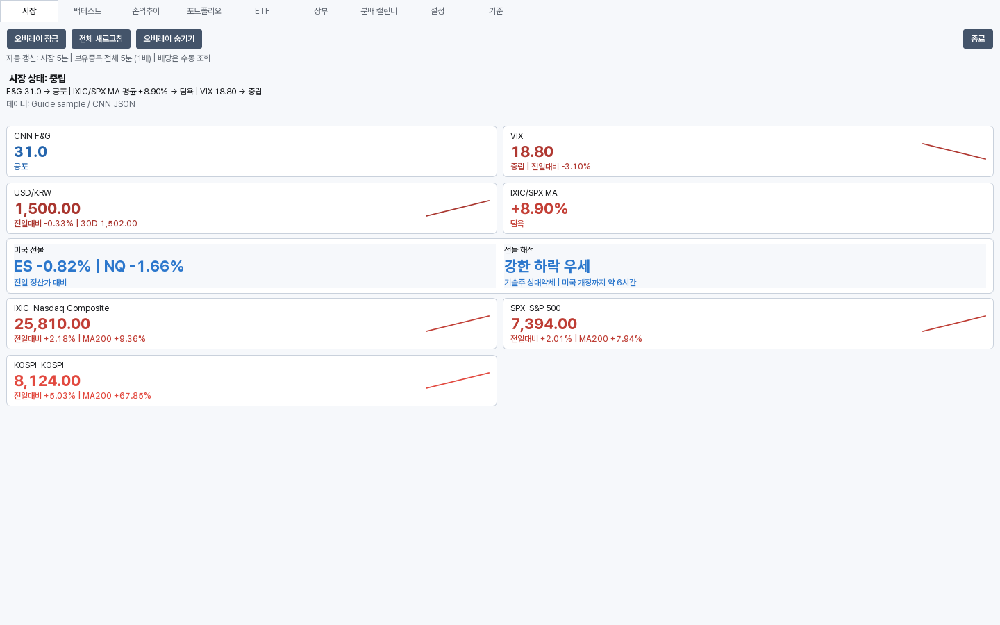

시장 지수·공포탐욕·VIX·환율과 미국 선물을 함께 확인합니다. 미국 선물은 정산가 대비 방향이며 현물의 정규장 전일대비와 다른 기준입니다. 조회 시점과 출처를 함께 확인하세요.

## 2. 포트폴리오: 현재 보유분

상단의 5개 카드는 총자산, 보유원금, 평가손익, 전일대비, 현금비중입니다.

- 총자산 = 보유평가액 + 예수금
- 평가손익 = 보유평가액 - 현재 보유분의 취득원가
- 평가수익률 = 평가손익 / 보유원금 × 100
- 현금비중 = 예수금 / 총자산 × 100

예수금은 총자산에는 포함하지만 평가손익에는 더하지 않습니다. 매도차익·배당·입출금도 평가손익에 섞지 않습니다. 원가 미확인 종목은 손익 집계에서 제외하고 반영 범위를 표시하며, 분모가 유효하지 않은 수익률은 숫자를 지어내지 않습니다.

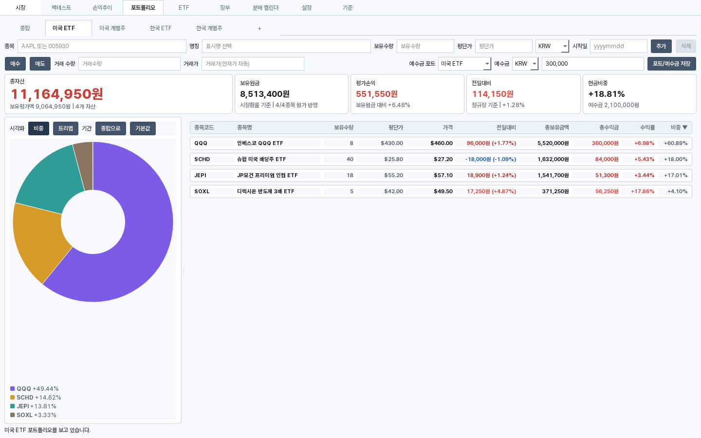

종합은 조회용입니다. 실제 보유 수량·평단가·예수금을 수정할 때는 개별 포트폴리오를 선택하세요. 외화 취득원가는 매수일 시장환율, 현재 평가액·외화 예수금은 현재 환율 기준입니다.

## 3. 백테스트: 지금 보유분을 과거에도 가지고 있었다면

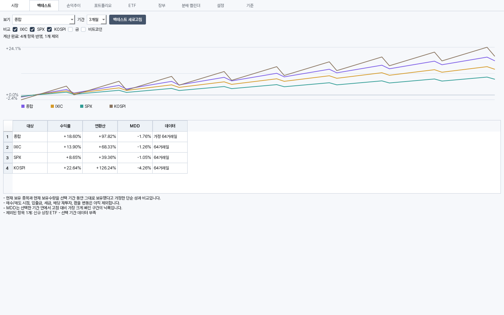

현재 보유 종목·수량을 선택 기간 내내 보유했다고 가정하여 시장지수와 비교합니다. 실제 매수·매도, 입출금, 세금, 배당 재투자와 환율 변동을 반영한 계좌 수익률은 아닙니다. 탭 진입 시 자동 계산하고 가격 이력을 10분 동안 재사용합니다. 데이터 부족으로 제외한 종목은 하단 안내에서 확인합니다.

## 4. 손익추이: 기록으로 재현한 변화

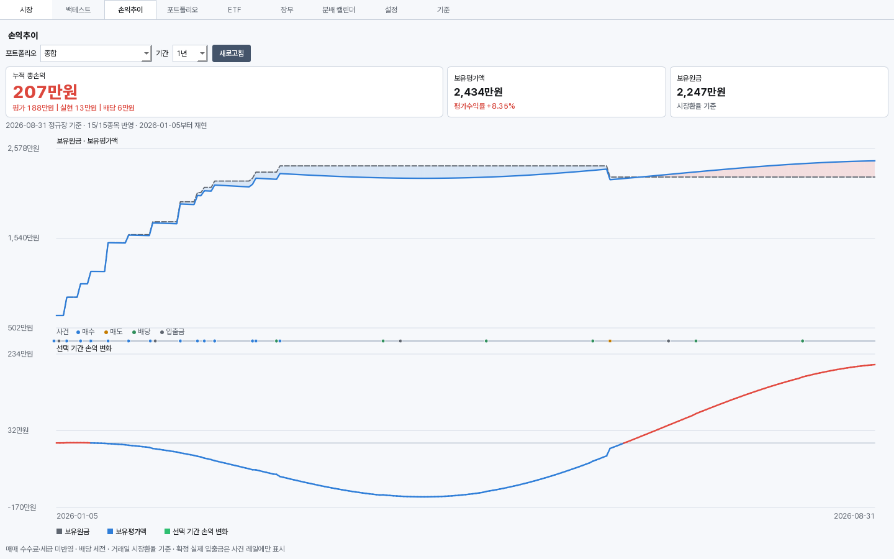

위 그래프는 정규장 기준 보유원금과 보유평가액입니다. 중간 사건 레일에는 매수·매도·배당·확정 실제 입출금이 구분됩니다. 아래 그래프는 **선택 기간 첫 지점의 누적 총손익을 뺀 손익 변화**여서 0원에서 출발합니다.

상단 카드의 누적 총손익은 평가손익 + 누적 실현손익 + 누적 배당입니다. 기간을 바꿔도 이를 입금 대비 수익률로 바꾸지는 않습니다. 거래일 시장환율을 사용하고 매매 수수료·세금은 미반영, 배당은 세전입니다. 입출금은 사건 표시일 뿐 성과선에 더하지 않으며 XIRR은 제공하지 않습니다.

기본 기간은 1년이고 1개월·3개월·6개월·1년·3년·5년·최대를 선택합니다. 재현 시작일, 반영 종목 수, 부분 재현 사유를 확인하세요. 현재 포트폴리오가 프리·애프터 가격을 쓰는 동안에는 정규장 기준 그래프 종점과 금액이 다를 수 있습니다.

## 5. ETF: 전체 목록과 상품 구조

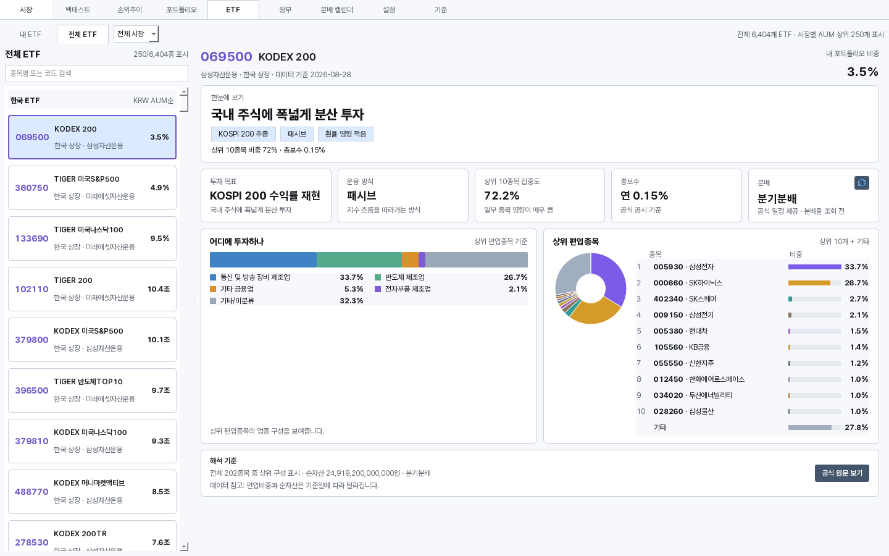

내장 카탈로그는 한국 1,163종 + 미국 5,241종 = **6,404종**입니다. 250은 전체 수가 아니라 한 번에 화면에 그리는 최대 건수입니다. 검색은 전체 카탈로그에서 수행하므로 첫 목록에 없는 종목도 코드로 찾을 수 있습니다.

전체 ETF는 시장별로 묶고 각 시장 안에서 순자산(AUM) 순으로 정렬합니다. 두 시장의 원화·달러 금액을 하나의 순위로 비교하지 않습니다. 내 ETF는 보유평가액 비중 순입니다.

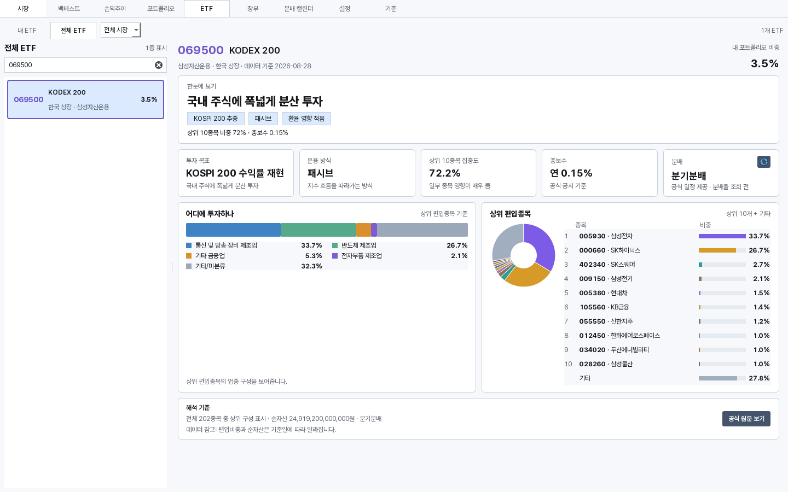

투자 목표, 운용 방식, 집중도, 비용, 공식 분배 주기와 상위 편입종목을 확인합니다. 레버리지·인버스·커버드콜·역방향 인컴·변동성 등 구조가 확인되면 일반 설명보다 먼저 표시합니다. 원천에 근거가 없는 값은 채우지 않습니다.

목록의 긴 이름은 `…`로 줄이고 전체 이름은 툴팁에서 확인합니다. 투자 목표는 지수명을 보존하고 명확한 설명부만 줄여 여러 줄로 표시하며, 전체 원문은 툴팁에 있습니다.

- 상위 10종목과 기타: 전체 바스켓이 공개되고 파생·음수·초과 노출 등 왜곡 조건이 없을 때만 기타를 계산합니다.
- 상위 편입종목 기준 업종: 국내 상위 편입종목과 상장사 업종을 연결한 보조 구성입니다. 전체 ETF 공식 업종 비중이 아닙니다.
- 좁은 창: 도넛과 별도 업종 카드 대신 편입종목 영역의 가로 업종 구성비로 전환합니다.
- 기준일: 국내는 공시 기준일, 미국은 실제 구성 기준일 미제공으로 수집일을 표시합니다.

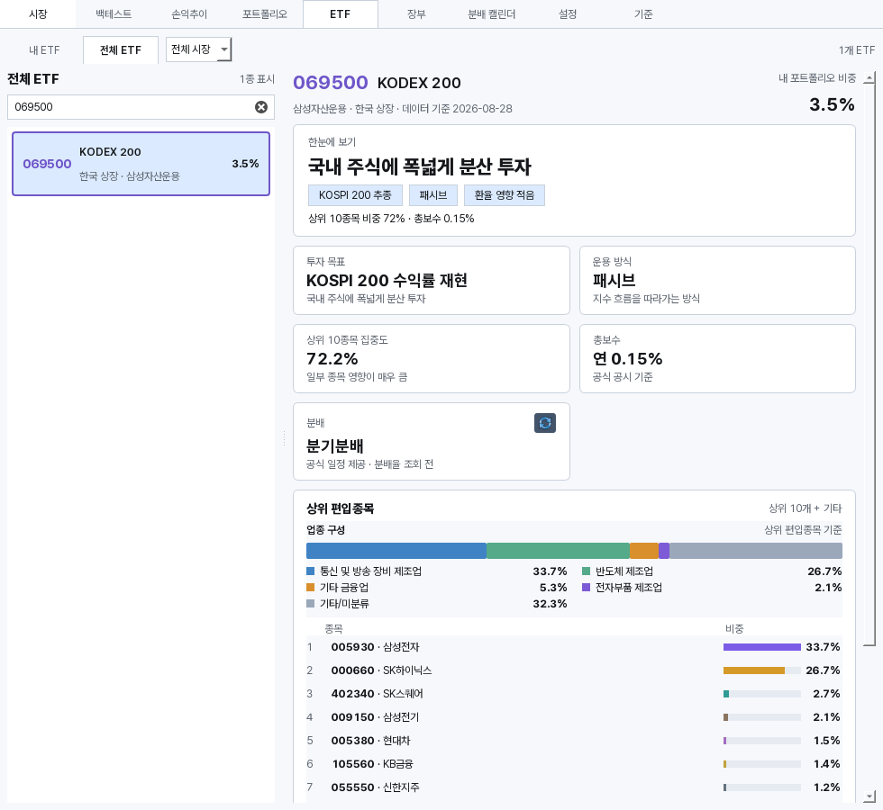

ETF를 선택하면 해당 종목의 분배 이력을 조회하고 24시간 캐시합니다. 최근 12개월 분배율과 과거 패턴 기반 예상 주기·분배율은 공식 지급 약속이나 세후 실수령액이 아닙니다. 공식 정보와 추정의 구분, 조회 실패·이전 값 안내를 확인하세요.

## 6. 장부

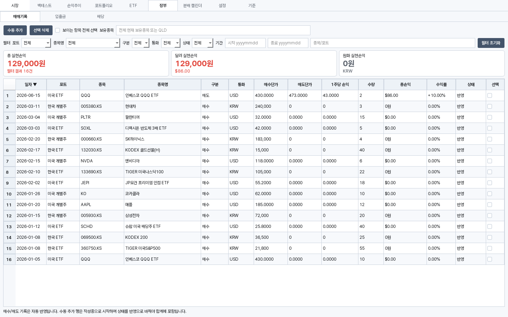

매매기록·입출금·배당을 한 탭 안에서 관리합니다. 실제 수량과 취득원가를 재현하려면 거래 날짜·가격·통화를 정확히 기록해야 합니다.

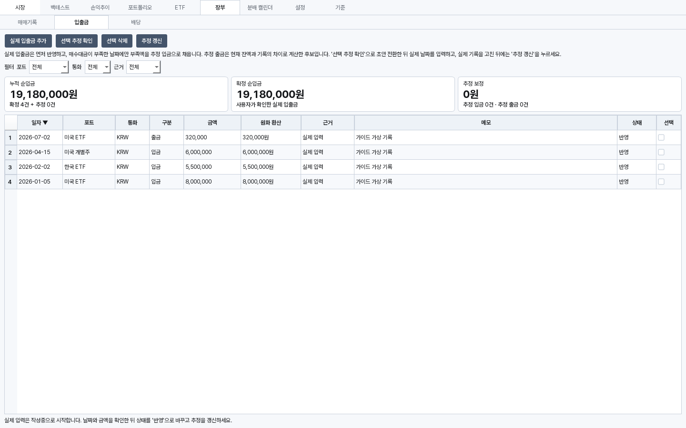

실제 입출금을 먼저 입력하고, 매수일 잔액 부족분을 추정으로 확인할 수 있습니다. 추정 출금은 실제 날짜를 지어내지 않고 후보 구간으로 구분합니다. 추정 기록은 확인·수정 전까지 확정 사실이나 성과 계산의 원금으로 취급하지 않습니다.

## 7. 분배 캘린더

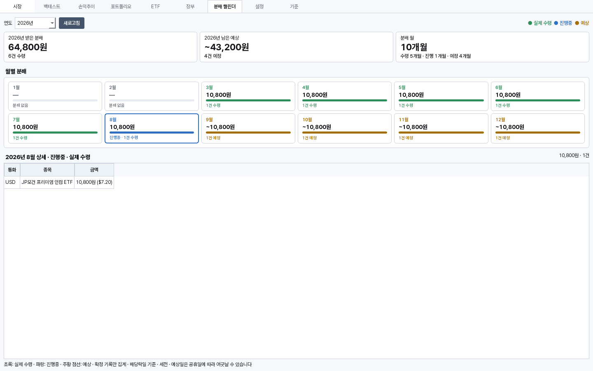

연도를 선택하면 1~6월·7~12월이 2×6 월 카드로 나옵니다. 받은 분배·진행 중인 달·예상을 색과 문구로 구분하고 월을 누르면 아래 상세가 바뀝니다. 실제 내역은 배당 장부, 향후 예상은 과거 지급 패턴 기준입니다. 계좌별 세금이나 미래 지급액을 확정하는 화면이 아닙니다.

날짜와 금액은 배당락일·세전 기준입니다. 실제 계좌 입금월이나 세후 수령액과 다를 수 있습니다.

## 8. 오버레이

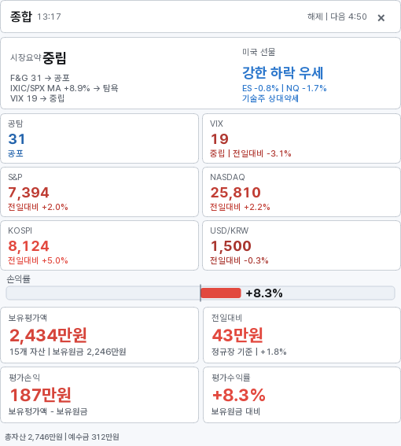

종합·내 포트폴리오 모드의 4개 카드는 **보유평가액·전일대비·평가손익·평가수익률**입니다. 보유원금은 보유평가액 아래 자산 수 옆에 있습니다. 전일대비는 정규장 기준으로, 프리·애프터를 반영한 현재 평가손익과 기준이 다를 수 있습니다.

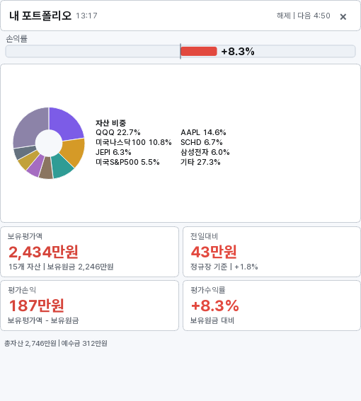

헤더의 ×는 오버레이만 숨깁니다. 컨트롤 창의 표시 버튼 또는 트레이 메뉴로 다시 열 수 있습니다. 앱 전체 종료와 다릅니다.

## 9. 설정과 기준

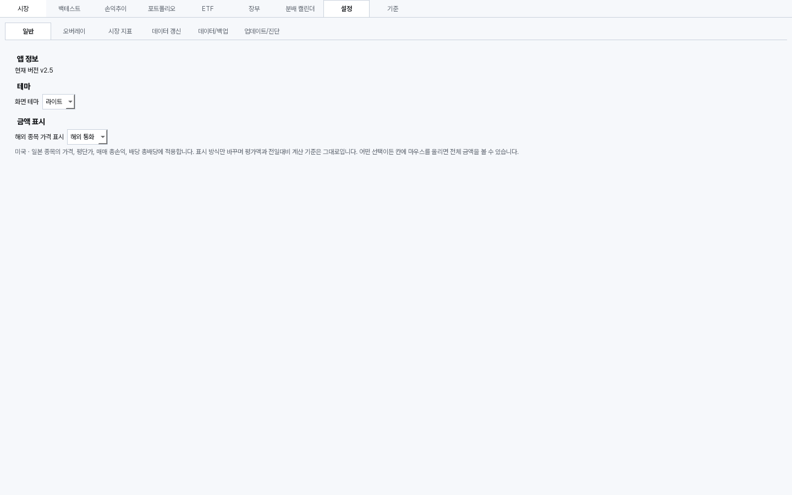

설정에서 테마·표시 단위·오버레이·데이터 갱신을 조정합니다. 업데이트 전에는 데이터/백업에서 백업을 내보내세요. 설치본 업데이트는 개인 장부를 초기화하지 않습니다.

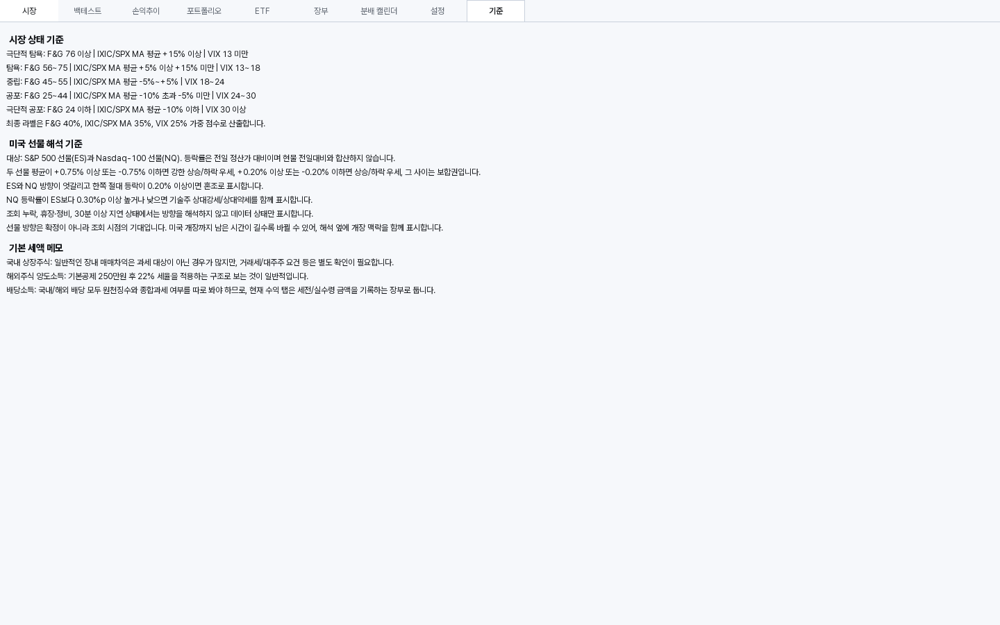

시장 판정이나 계산 방식이 궁금할 때는 기준 탭과 이 가이드의 계산 설명을 함께 확인하세요.

## 10. 다크 테마

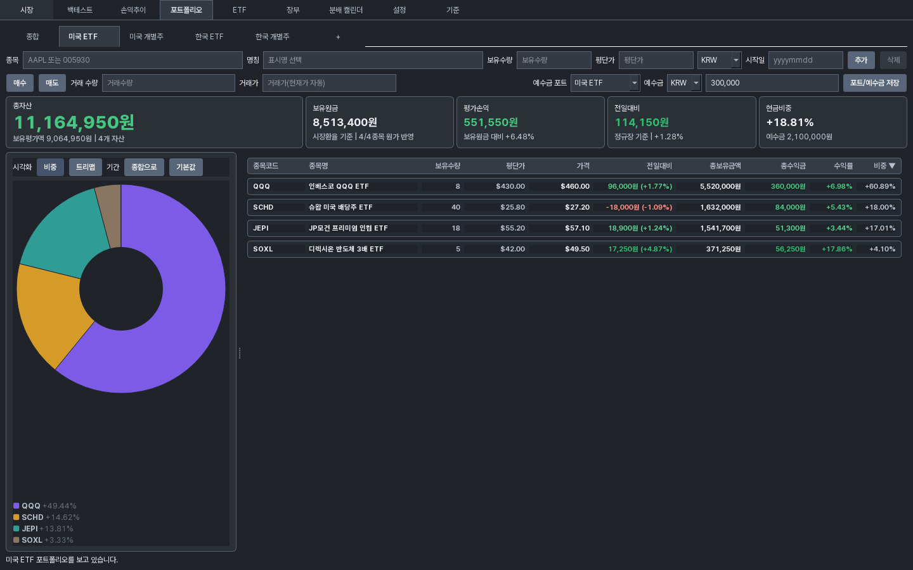
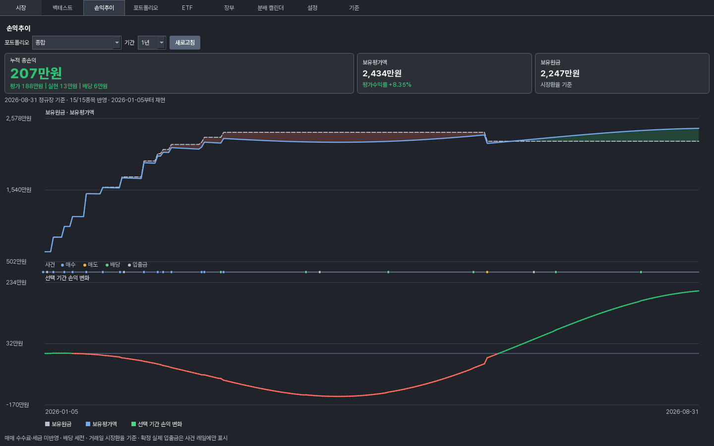
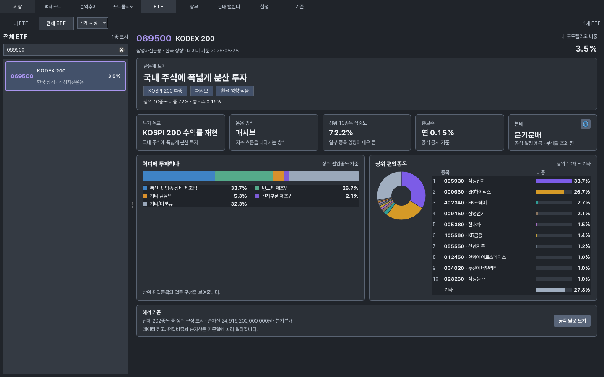

라이트 상승/하락은 적/청, 다크는 녹/적입니다. 종목·업종·사건별 색은 범주 구분이므로 등락색과 혼동하지 마세요.

## 데이터 주의

내장 ETF는 실시간 전체 재수집이 아닙니다. BNK 7종은 2026-08-10, TIME 18종은 2026-08-20의 마지막 검증 공식 원문을 보존하며, 나머지도 원천별 기준일이 다릅니다. 시세·환율·ETF 설명·분배 추정은 투자 판단을 돕는 참고 자료이며 증권사 잔고·공시·실제 지급과 차이가 있을 수 있습니다.
